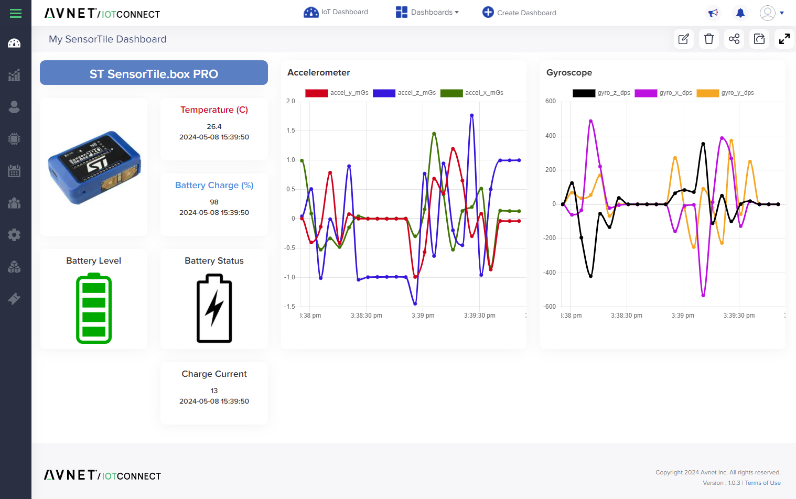

# /IOTCONNECT Bridge App

A mobile phone or tablet can be used as a gateway for connecting edge devices (often using Bluetooth) to the /IOTCONNECT platform. The **/IOTCONNECT Bridge** app (formerly "IoT Bridge") is available for both iOS and Android.

### Download the App

Scan to install the App Store / Play Store release used by **Path 1**. **Path 2 (ST AIoT Craft)** uses a separate **beta build distributed via Updraft** — those QR codes are inside the Path 2 guides.

|  **iOS**  |  **Android**  |
|:---:|:---:|
|  |  |

This repo covers **two distinct paths** for using the Bridge App. Pick the one that matches your goal:

---

## Path 1 — Mobile App as a BLE Gateway (production /IOTCONNECT on AWS)

The original use case: stand the Bridge App up as a Bluetooth → WAN gateway so a BlueST-SDK-compatible ST device can stream telemetry into /IOTCONNECT and be visualized on a dashboard. This path runs against the **production AWS** instance of /IOTCONNECT and uses the app-store releases of the Bridge App.

**Use this path if you want to:** get a sensor onto /IOTCONNECT quickly, demo BLE telemetry end-to-end, or wire a BlueST device into an existing /IOTCONNECT production tenant.

  
   
  <em>The Path 1 payoff — live accelerometer, gyroscope, temperature, and battery telemetry from the SensorTile.box PRO, gatewayed through the Bridge App into a /IOTCONNECT dashboard.</em>

### Supported Edge Devices
ST devices compatible with the [BlueST-SDK](https://www.st.com/en/embedded-software/bluest-sdk.html), including:
* ST PROTEUS [STEVAL-PROTEUS1](https://www.st.com/en/evaluation-tools/steval-proteus1.html)
* ST SensorTile.box PRO [STEVAL-MKBOXPRO](https://www.st.com/en/evaluation-tools/steval-mkboxpro.html)

### Walkthrough
ST SensorTile.box PRO — [Mobile App Guide](mobile_app_guide.md)

---

## Path 2 — Edge AI Lifecycle with ST AIoT Craft (AWS POC instance)

A newer capability that ties the Bridge App together with **ST AIoT Craft** to drive the full Edge AI lifecycle on the SensorTile.box PRO: subscribe to /IOTCONNECT, push a starter MLC model OTA, watch live inference, then capture and label your own sensor data so AIoT Craft can train a new model — closing the **capture → train → deploy → inference → retrain** loop without ever picking up a USB cable.

This path runs against the **AWS POC** instance of /IOTCONNECT (the environment used for the AIoT Craft preview; production release is planned for June) and uses a **beta Bridge App build** distributed via Updraft, not the app-store version. The QR codes and URLs in these guides differ from Path 1 — use the ones in the guide.

**Use this path if you want to:** explore Edge AI on the SensorTile.box PRO, evaluate ST AIoT Craft alongside /IOTCONNECT, or run the lab-style training-loop demo.

### What the loop looks like

<table>
  <tr>
    <td align="center" width="33%">
       
      <b>1. Deploy</b> 
      Pick a starter MLC model in the Bridge App and push it OTA to the box.
    </td>
    <td align="center" width="33%">
       
      <b>2. Infer</b> 
      Watch live on-device inference (Smart Asset Tracking shown) stream into the phone.
    </td>
    <td align="center" width="33%">
       
      <b>3. Capture &amp; Train</b> 
      Log labeled sensor sessions to the microSD, upload via phone, let AIoT Craft train a new model — then OTA it back.
    </td>
  </tr>
</table>

### Walkthroughs
The AIoT Craft path is split into two labs (the consolidated single-file version is also available):

* **[Lab 1 — Deploy a Starter MLC Model](st_aiotcraft_lab1_deploy.md)** — zero to a pre-built model running on the box, with live inference on the phone and a /IOTCONNECT dashboard.
* **[Lab 2 — Train Your Own MLC Model](st_aiotcraft_lab2_train.md)** — capture labeled sensor data, train a custom MLC model with AIoT Craft, OTA it back to the device.
* [Consolidated single-file guide](st_aiotcraft_guide.md) — same content as the two labs, one document.

---

## Which path should I pick?

| | Path 1 — BLE Gateway | Path 2 — AIoT Craft |
|---|---|---|
| /IOTCONNECT environment | Production AWS | AWS POC (preview) |
| Bridge App build | App Store / Play Store | Beta (Updraft) |
| Device firmware | BlueST-SDK firmware (e.g., `BLESensorsPnPL.bin`, `STSW-MKBOXPRO_1_1_1.bin`) | `FP-SNS-DATALOG2_Datalog2 v3.1.0` |
| Focus | Telemetry → dashboard | Edge AI: deploy + train MLC models |
| Devices | Any BlueST-SDK device | SensorTile.box PRO |
