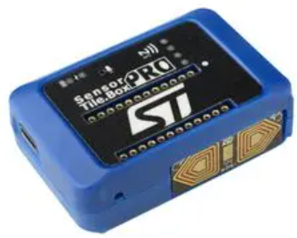
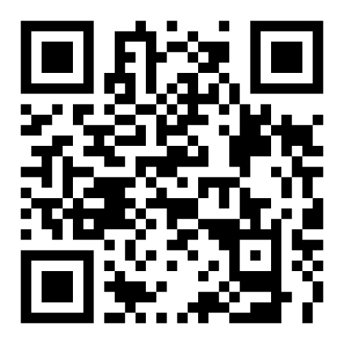
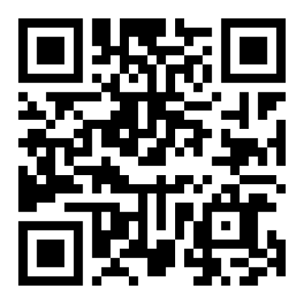

# IoTConnect Mobile App with ST SensorTile.box PRO
This guide will walk through setting up the Avnet IoTConnect mobile app to be leveraged as a Bluetooth gateway.  
Acting as a gateway, the IoTConnect app will capture Bluetooth telemetry data and transport it to the IoTConnect cloud to visualize.
  

## Prerequisites
In addition to the ST SensorTile.box PRO device, you will need the following:  
- A free [MyST](https://my.st.com/cas/login) account  
- A free "Test Drive" [IoTConnect on AWS](https://subscription.iotconnect.io/subscribe?cloud=aws) account  
- An Android or iOS device (*acts as the BLE to WAN bridge)*
- iOS Users[^1], ST SensorTile firmware: [BLESensorsPnPL.bin](https://saleshosted.z13.web.core.windows.net/demo/st/ble/STBoxPro/BLESensorsPnPL.bin)
- Android Users[^2], ST SensorTile firmware:  [STSW-MKBOXPRO_1_1_1.bin](https://github.com/STMicroelectronics/appconfig/raw/release/bluestsdkv2/bin/steval-mkboxpro/STSW-MKBOXPRO_1_1_1.bin)
- A PC with the latest [STM32CubeProgrammer](https://www.st.com/en/development-tools/stm32cubeprog.html) installed
- A USB-A to USB-C cable
- Desire to learn!
[^1]: The "BLESensorsPnPL.bin" example was chosen because it provides the most variety of usable telemetry data to be utilized by IoTConnect, including temperature, battery information, acceleration, and gyroscope data.
[^2]: A compatibility issue was discovered between the “BLESensorsPnPL.bin” firmware and the Android application using the [BlueSTSDK_Android](https://github.com/STMicroelectronics/BlueSTSDK_Android) library, resulting in mismatched acceleration data not being uploaded to the cloud. Please use the alternative “STSW-MKBOXPRO_1_1_1.bin” firmware, which does not include temperature data.

## 1. Download the IoTConnect Application  
Use the QR codes below to download the latest IoTConnect "IoT Bridge" application.  
### iOS App  
  

### Android App  

Launch the "IoT Bridge" application and proceed to the next section.  

## 2. Create an IoTConnect Account  
> **NOTE**  
> If you've already created an account, you may skip to the next section.  

If you need to create an account, follow one of the methods below:  

  
Method 1: Use the App [Recommended]

1. Press the **Sign Up** button at the bottom 
 

2. Ensure "AWS" is selected as the Service Provider and click **Subscribe Now** for the "Test Drive" 
 

3. Complete the registration form. 

4. Expect two emails from IoTConnect, one of which contains a temporary password. 

  
Method 2: Use a Browser

  
  1. Navigate to the [IoTConnect Subscription](https://subscription.iotconnect.io/subscribe?cloud=aws) page 
  
  2. Ensure "AWS" is selected as the Service Provider and click **Subscribe Now** for the "Test Drive" 
   
  
  3. Complete the registration form. 
  
  4. Expect two emails from IoTConnect, one of which contains a temporary password. 

> **NOTE**  
> Check your email SPAM folder if you don't receive the emails after a couple minutes.

## 3. Enter Credentials and Choose Environment  
* Return to the mobile app home screen and enter your credentials.  
* Ensure that `console.iotconnect.io (AWS)` is selected as the environment to use and press **Login**.  

## 4. Update Firmware  
A firmware version that exposes the sensor data via Bluetooth is required to be loaded on the device.  
> **IMPORTANT**  
> Ensure your device is in DFU mode.  Refer to Chapter 2.2 of the [SensorTile Getting Started Guide](https://www.st.com/resource/en/user_manual/um3133-getting-started-with-sensortilebox-pro-multisensors-and-wireless-connectivity-development-kit-for-any-intelligent-iot-node-stmicroelectronics.pdf) for instructions.  
1. Connect power to the device (e.g. "ST SensorTile.box PRO") using a USB cable.  
2. Open the STM32CubeProgrammer  
3. Select **USB** for the connect type and select **Connect**  
4. Click the "Erasing & Programming" icon and browse to the previously saved file:  [BLESensorsPnPL.bin](https://saleshosted.z13.web.core.windows.net/demo/st/ble/STBoxPro/BLESensorsPnPL.bin)(iOS) or [STSW-MKBOXPRO_1_1_1.bin](https://github.com/STMicroelectronics/appconfig/raw/release/bluestsdkv2/bin/steval-mkboxpro/STSW-MKBOXPRO_1_1_1.bin)(Android) 
5. Click **Start Programming**
6. Once completed successfully, close the application and power cycle the device.

> For additional information and troubleshooting, please refer to Chapter 2.2 of the [ST SensorTile.box PRO Getting Started Guide](https://www.st.com/resource/en/user_manual/um3133-getting-started-with-sensortilebox-pro-multisensors-and-wireless-connectivity-development-kit-for-any-intelligent-iot-node-stmicroelectronics.pdf)  

## 5. Connect Device and Push Data 
With the IoTConnect mobile app open and the SensorTile device powered, it will be displayed in the device list.  
* If after a short time, if no devices are displayed, press the green menu button in the lower-right corner and select "**Scan Device**".
  

* Identify the device to connect to (e.g. "BLEPnP" or "STbox...") and click on it.  (Names may vary by firmware type/version)

Clicking on the device will automatically perform the following steps:  
1. Create the device template in the IoTConnect platform  
2. Create a device in the IoTConnect platform using the identified device template
3. Display a list of the detected sensors  

* Choose the **Select All** option at the top to select all available data and press **Push Data**

* After a few seconds, the sensor values will be updated in the mobile app and subsequently sent to IoTConnect.  

## 6. View Live Data on IoTConnect  
Using your credentials, login to IoTConnect in a browser:  
* IoTConnect on AWS - [https://console.iotconnect.io](https://console.iotconnect.io)  

Once logged in, select the Devices icon from the left-hand menu and click "Device"  

The automatically created device will be visible.  
* Click on the **Unique ID** of the device to display the Device Info  
* Click on the **Live Data** to view the data from the Mobile App  

## 7. Visualize the Data  
Dashboards are used to easily visualize data.  
* Download the [ST SensorTile.box PRO Dashboard Template](dashboards/SensorTileBoxPRO_dashboard_export.json) (Right-click and open in new window)  
* Click the **Download** icon to save the file and take note of the location  
  

* Once downloaded, select "Create Dashboard" from the top of the IoTConnect portal and then choose the "Import Dashboard" option.

* Enter a name for the dashboard (e.g. "My SensorTile Dashboard")  
* Click "Browse" and select the dashboard template (.json) file downloaded previously which will cause two new fields to appear.  
* Select "AvnetSTaws" from the **Template** drop-down  
* Select the unique device name from the **Device** drop-down
* Click **Save**  
  

* The dashboard will be imported and displayed in "Edit Mode"  
* Feel free to edit or just click the blue **Save** button in the top right to save the layout and exit the edit mode.  

