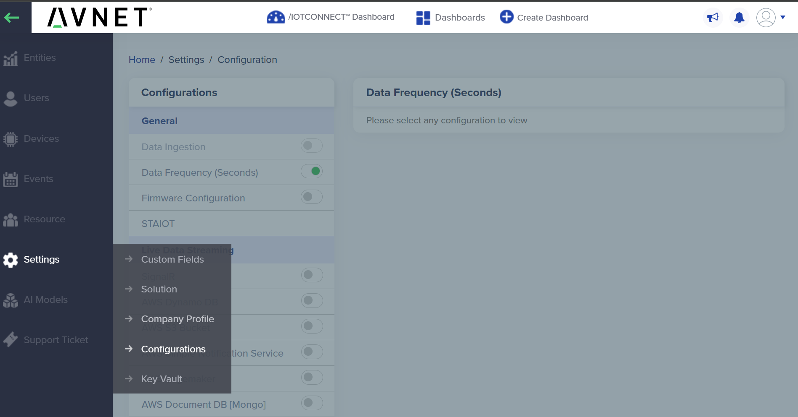
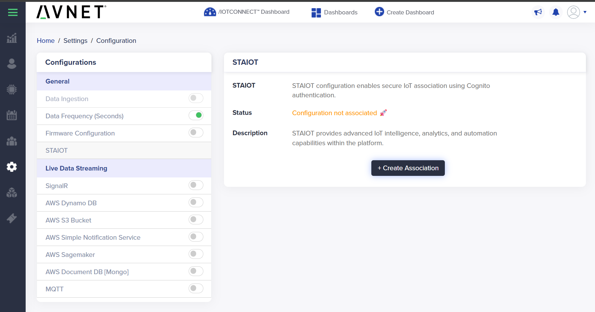
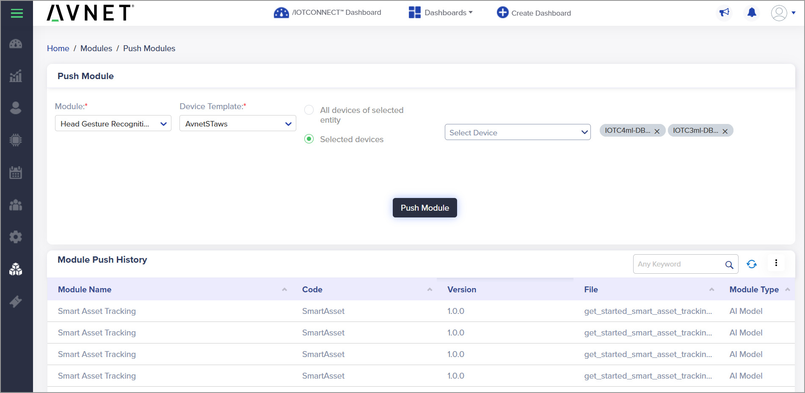
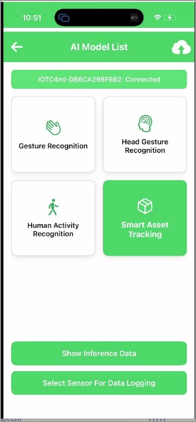

# /IOTCONNECT Bridge App with ST SensorTile.box PRO  <br> Powered by ST AIoT Craft

This guide walks through the end-to-end Edge AI lifecycle using the Avnet **/IOTCONNECT Bridge** mobile app, the **ST SensorTile.box PRO**, and **ST AIoT Craft**. You will subscribe to /IOTCONNECT, connect the Bridge App to the cloud, push a starter AI model down to the device, view live inference, build a dashboard, then capture and label your own sensor data so AIoT Craft can train a new MLC model — all without ever picking up a USB cable after the device is in your hand.


> **NOTE**
> This guide tracks the **AWS POC** instance of /IOTCONNECT (the environment used for the ST AIoT Craft preview). Production release is planned for June; release notes are tracked at <https://docs.iotconnect.io/iotconnect/platform/product-updates/>. Where the [main mobile app guide](./mobile_app_guide.md) covers the production AWS environment, **use the URLs in this guide** for the AIoT Craft flow.

## Prerequisites

In addition to the ST SensorTile.box PRO, you will need:

- A **/IOTCONNECT POC** account — you will create this in Step 1
- An Android or iOS device (acts as the BLE-to-WAN bridge)
- A SensorTile.box PRO running **FP-SNS-DATALOG2_Datalog2 v3.1.0** firmware (this is the version AIoT Craft expects; the kits handed out for the lab ship pre-flashed)
- The 7-character identifier printed on the back of your SensorTile.box PRO — you will use it to pick the right device out of the BLE list
- Desire to learn!

> **NOTE**
> If you need to (re)flash the SensorTile.box PRO yourself, refer to Chapter 2.2 of the [SensorTile.box PRO Getting Started Guide](https://www.st.com/resource/en/user_manual/um3133-getting-started-with-sensortilebox-pro-multisensors-and-wireless-connectivity-development-kit-for-any-intelligent-iot-node-stmicroelectronics.pdf) for DFU instructions and the [STM32CubeProgrammer](https://www.st.com/en/development-tools/stm32cubeprog.html). The flow in this guide assumes the datalog2 firmware is already on the box.

## 1. Subscribe to /IOTCONNECT

Open the /IOTCONNECT POC subscription page:
[http://avnet.me/IOTC-4-ST](http://avnet.me/IOTC-4-ST) (resolves to <https://pocsubscription.iotconnect.io/registration>).


* Pick the **Trial** plan (1 month free, no credit card required) and click **Subscribe Now**.

Complete the registration form:


> **IMPORTANT**
> The email you submit here becomes the **account owner** with full admin permissions, and the company name you enter becomes your account's unique identifier (CPID). For the lab, use your real company name **plus something unique** (e.g., your initials) — the form will reject duplicate emails and company names across the instance.

## 2. Receive Account Information Emails

After submitting registration, expect two emails from /IOTCONNECT:

| | |
|---|---|
|  |  |
| **Welcome to /IOTCONNECT** — plan info and the green **VIEW /IOTCONNECT** button that takes you to the login page. | **Temporary password** — single-use, you'll be forced to reset it on first login. |

If you requested the *Smart Asset Solution* at signup, you will also see a third email pointing at that solution.


> **NOTE**
> Check your SPAM folder if the emails don't arrive within a couple of minutes.

## 3. Log in to /IOTCONNECT

Open the login page in a browser:
<https://awspoc.iotconnect.io/login>


* Enter your email and the temporary password from the second email.
* You will be redirected to a **Reset Password** page — set a new password and submit.
* Log in again with your new password.

After authentication you land on the **Company Account Dashboard**.


## 4. Connect /IOTCONNECT to ST AIoT Craft

This step links your /IOTCONNECT tenant to the ST AIoT Craft cloud so trained models can flow back from AIoT Craft into your AI Module Library.

1. Open the side menu and navigate to **Settings → Configurations**.
   
   

3. In the **General** section, click **STAIOT**.

   

4. On the right-hand panel, click **+ Create Association**.

5. A Cognito sign-in dialog opens. Choose **avnet-iotc-stage**.

   

> **NOTE — Known issue**
> Occasionally an AIoT Craft training job will fail. The /IOTCONNECT and ST teams are actively addressing this. If it happens, retry the same flow with a fresh dataset.

## 5. Download the /IOTCONNECT Bridge App (Beta)

Use the QR codes below to install the Bridge App. (This is the beta build distributed via Updraft; the app-store release lands in June.)

### iOS App
URL: <http://avnet.me/iotc-ios-bridge>


### Android App
URL: <http://avnet.me/iotc-android-bridge>


> **iOS only — "Untrusted Enterprise Developer"**
> Because the beta is distributed outside the App Store, iOS 26 will block it on first launch with the message **"Untrusted Enterprise Developer."** To trust it:
> 1. Open **Settings → General → VPN & Device Management** (may appear as **Profiles & Device Management**).
> 2. Under **Enterprise App**, tap the developer **Softweb Solutions Inc.** and tap **Trust**, then confirm.
> 3. iOS may ask you to **Allow & Restart** — let it. After reboot, complete any **"Ready to Install Profile"** prompt and tap **Done**.
> 4. Launch the Bridge App from your Home Screen.

> **Android only — "Install unknown apps" / Play Protect**
> Because the beta is distributed via Updraft (not the Play Store), Android will prompt you a couple of times before letting it install. Open the Updraft URL in **Chrome** on your phone and:
> 1. Tap **Install** on the Updraft page. Chrome will say **"For your security, your phone isn't allowed to install unknown apps from this source."** Tap **Settings**.
> 2. Toggle **Allow from this source** on for Chrome (or the browser you used). Back out — the install prompt resumes automatically.
> 3. Tap **Install** on the package installer screen.
> 4. If **Play Protect** warns *"Block harmful app?"* or *"App not approved by Play Protect,"* tap **More details → Install anyway**. The app is unsigned for the Play Store, not malicious.
> 5. When install completes, tap **Open** to launch the Bridge App from the installer, or find the icon in your app drawer.

## 6. Log in to the Bridge App

Open the **/IOTCONNECT Bridge** app and sign in.


* Use the **same credentials** you used in the browser.
* Set the environment to **`awspoc.iotconnect.io (AWS)`**.
* Tap **Login**.

## 7. Pair the SensorTile.box PRO

With the box powered on, the Bridge App scans for BLE devices automatically.


* Locate the device whose name ends with the **7-character identifier printed on your box** (the screenshot shows a generic `IOTC4ml` example — yours will differ).
* If the list stays empty after a few seconds, tap the green menu button in the lower-right corner and choose **Scan Device**.
* Tap your device to pair.

Tapping the device will automatically:
1. Create a device template in /IOTCONNECT (if one does not already exist for this firmware).
2. Register a new device in /IOTCONNECT keyed to your box's identifier.
3. Show the **/IOTCONNECT Details** sheet confirming the connection.

   

## 8. Verify the Device in /IOTCONNECT

Switch back to the browser and confirm the device showed up.

* From the left menu open **Devices → Device**.

  

* Sort by **Last Connection** (click the column header twice for descending) to bring your newly paired device to the top — its Provisioning Status should be **CONNECTED**.

  

* Click the **Unique ID** of your device to open the Device Info page.

  

## 9. Verify the Template

The Bridge App also auto-creates the **AvnetSTaws** template if it isn't already there. From **Templates** you can confirm the template exists, has File Upload enabled (so the Bridge App can ship logging sessions to /IOTCONNECT), and exposes the SensorTile attribute set.


* Click into **AvnetSTaws** to see its **Properties** (note **Enable File Support** is on)…

  

* …and its **Attributes** (47 sensor attributes — accel, gyro, RMS speed, MLC features, etc.).

  

## 10. Push a Starter AI Model

/IOTCONNECT ships with four ready-to-run starter modules under **Modules → Module**. These are the same model format AIoT Craft produces, so once you've walked the loop with one of these you've already seen the deployment story end-to-end.

| Starter module | What it detects |
|---|---|
| **Gesture Recognition** | Hand & wrist motion patterns |
| **Head Gesture Recognition** | Nod, shake, tilt — wearables |
| **Human Activity Recognition** | Walking, running, stationary, fall |
| **Smart Asset Tracking** | Stationary upright / not upright, motion, shaken |


> **NOTE**
> The **Module Library** tab lets you create or upload custom modules. The **Module** tab is the per-account, deployable list — the entries here can be pushed to devices.
>
> 

To deploy one:

1. Open **Modules → Push Modules**.
2. Pick a **Module** (e.g. *Smart Asset Tracking*).
3. Pick the **Device Template** (`AvnetSTaws`).
4. Choose **All devices of selected entity** or **Selected devices** → pick your device.
5. Click **Push Module**.

   

The Bridge App receives the OTA over BLE and writes the module to the SensorTile.box PRO's Machine Learning Core.

## 11. View Live Inference on the Phone

After pairing, the Bridge App lands on the **AI Model List** screen with the modules available for your device.



* Tap a model card (e.g. **Smart Asset Tracking**). The app downloads the module if it isn't already cached.

  

* Tap **Show Inference Data** at the bottom. The app pushes the device into inference mode and starts streaming MLC results.

  

For *Smart Asset Tracking*, the four classes light up in real time as you pose the box:

| | | | |
|---|---|---|---|
|  |  |  |  |
| Stationary Upright | Stationary Not Upright | Motion | Shaken |

Inference results are also streamed to /IOTCONNECT as telemetry, ready for dashboards in the next step.

## 12. Create a Dashboard

Dynamic Dashboards visualize live telemetry, inference history, and any other attribute attached to your device template.

* Download the [ST AIoT Craft dashboard template](https://iotcimage.s3.us-east-1.amazonaws.com/dashboards/STMicro/aiotcraft/ST_AIoT_CraftDashboard.json) (right-click and **Save As…**).
* In /IOTCONNECT, click **Create Dashboard** at the top right and choose **Import Dashboard**.

  

* In the dialog, browse to the saved `.json` file, then fill in:

  

  1. **Template** = `AvnetSTaws`
  2. **Device** = your unique device
  3. **Dashboard Name** = e.g. `ST AIoT Craft -ml4- SensorTile.Box Pro`
  4. Leave **Only Visible to Me** checked if you don't want to share within your account
  5. Pick a **Background Color** (e.g. `EEEEEE`)
  6. Click **Save**

  

* The dashboard opens in **Edit Mode** with the imported widgets and a widget palette. Drop in additional widgets if you like, or click the blue **Save** in the top-right to exit edit mode.

  

* Find your dashboard later under **Dashboards** in the top menu.

  

The finished view shows live inference (`Smart Asset Monitoring` widget), telemetry, device log, and notifications — all bound to the device you just paired.


> **TIP**
> The dashboard supports five management actions from the top bar: **Refresh Data**, **Edit Mode**, **Delete**, **Share Link** (no login required), and **Export to JSON** (handy when onboarding another device). You can also confirm raw data flow by clicking **Live Data** on the device's Device Info page.
>
> 

## 13. Capture Labeled Sensor Data for Training

This is the half of the loop that feeds **ST AIoT Craft**. Logging mode swaps the device out of inference and streams raw sensor samples into a session that gets zipped and uploaded to /IOTCONNECT.

* From the Bridge App's **AI Model List**, tap **Select Sensor For Data Logging**.
* Choose the sensor(s) you want to record (e.g. **Accelerometer**, **Gyroscope**) and tap **Start**.

  

* On the next screen, pick the **labels** you want to associate with this session. The app shows a live chart of the sensor stream so you can confirm signal before recording.

  

* Press **Start** and perform each motion/activity for the duration you want it labeled. When done, press **Stop**.

  

> **Labeling — 4 Simple Rules**
> 1. **Pick at least 2 labels.** Single-label training fails with "job failed" — this is the #1 cause.
> 2. **At least 5 seconds per label.** Less than 5s → no association → upload may parse but training will reject it.
> 3. **Multiple labels can overlap.** If you press *Shaken* and then press *Motion* without releasing *Shaken*, both get entries in `acquisition_info.json`. The first label is **not** auto-released — overlap is intentional.
> 4. **Re-pressing a label that already logged is ignored.** If you select *Shaken*, log it, deselect, then re-select *Shaken*, the second selection adds nothing — the cloud already has *Shaken* data for this session.

Stopping the session leaves the labeled data on the SensorTile.box PRO's microSD card — it does **not** auto-upload. **Step 14** walks through pushing it to /IOTCONNECT so AIoT Craft can train on it.

## 14. Push Samples to /IOTCONNECT

To kick off training, the session files have to move from the device's microSD card up to /IOTCONNECT. The Bridge App's **SD Card** screen walks you through it.

1. **Stop training.** Confirm you're back at the *Accelerometer* screen with logging stopped and your tags still selected.

   

2. **Find the log folder.** Open the **SD Card** section in the Bridge App. You'll see a "Follow these steps" help screen explaining the dongle workflow.

   

3. **Plug in the SD card.** Power down the box, pop the microSD out, slot it into a USB-C / Lightning microSD dongle, and connect the dongle to your phone. Tap **Connect and Select Root**, grant access, and browse to the `STM32` folder — each logging session is a date-named folder (e.g. `20260429_21_30_06`).

   

4. **Select / push the files.** Open the most recent session folder, tick all three files (`acquisition_info.json`, `device_config.json`, and `lsm6dsv16x_acc.dat` / `_gyro.dat`), and push.

   

5. **Upload Success.** When the bundle has been zipped and accepted by /IOTCONNECT, the app shows an **Upload Success** confirmation. The session is now queued for AIoT Craft to consume.

   

> **NOTE**
> The upload is the trigger for AIoT Craft to start training. If a session never makes it into /IOTCONNECT, no `.ucf` model will come back — make sure each labeled session ends with the **Upload Success** popup.

## 15. Inspect a Logged Session

Each session is a folder on the device's SD card (and a zip in /IOTCONNECT) containing three artifacts:

| | |
|---|---|
|  |  |

* **`acquisition_info.json`** — every label you pressed, with start/stop timestamps. The cloud uses this to slice the raw `.dat` files into labeled chunks.
* **`device_config.json`** — sensor configuration (ODR, full-scale, enabled axes) at recording time. The cloud needs this to interpret the binary correctly.
* **`lsm6dsv16x_acc.dat` / `lsm6dsv16x_gyro.dat`** — raw binary samples, parsed and chunked into CSV by AIoT Craft.

To find the upload in /IOTCONNECT, open your device's Device Info page and click the **Telemetry Files** tab. Each row is one logging session with timestamp, size, and a download link.

> **NOTE**
> If a freshly stopped session doesn't appear immediately, give it a minute — the upload happens after the session closes, not during recording.

## 16. The MLC Retraining Loop

Once one or more labeled sessions are sitting in /IOTCONNECT, the connector you set up in **Step 4** forwards the binary HSD data to ST AIoT Craft, which runs AutoML / AFS to produce a `.ucf` MLC model. AIoT Craft pushes that model **back** into your account's AI Module Library, and a single **Push Module** click delivers it to the device:

```
[Device]            [BLE]      [Bridge App]   [/IOTCONNECT]   [Connector]   [ST AIoT Craft]
   │                  │             │              │              │              │
   │ MLC inference ──►│ ───────────►│ Telemetry    │              │              │
   │                  │             │ ───────────► │ Stored as    │              │
   │                  │             │              │ template     │              │
   │ Switch→logging ◄─┤ ◄───────────┤ Cmd from     │              │              │
   │ datalog2 firmware│             │ cloud        │              │              │
   │                  │             │              │              │              │
   │ Raw .dat + JSON ►│ ───────────►│ Zip + upload │              │              │
   │                  │             │ ───────────► │ Forward via  │              │
   │                  │             │              │ connector ──►│ Blob ingest  │
   │                  │             │              │              │ (binary-hsd) │
   │                  │             │              │              │ ───────────► │ Chunks (CSV)
   │                  │             │              │              │              │ AutoML / AFS
   │                  │             │              │              │              │ trains MLC
   │                  │             │              │              │ ◄────────────┤ .ucf model
   │                  │             │              │ Module ◄─────┤              │
   │                  │             │              │ registered   │              │
   │                  │             │              │ in library   │              │
   │ load_model PnPL ◄┤ ◄───────────┤ Push module  │              │              │
   │ command          │             │ (OTA)        │              │              │
   │                  │             │              │              │              │
   │ MLC reprogrammed,│             │              │              │              │
   │ inference resume►│ ───────────►│ ───────────► │ Live again   │              │
```

To verify a freshly trained model:

1. /IOTCONNECT → **Modules → Push Modules** → select your new module → **Push**.
2. In the Bridge App, return to **AI Model List** (if connected the new module appears) and tap **Show Inference Data** to switch the box back into inference mode.
3. Watch the dashboard — your model is now running on real hardware.

> **Capture → Upload → Train → Deploy → Inference → (capture more) → Retrain**

## 17. Find Your Trained Model in /IOTCONNECT

When AIoT Craft finishes training (typically ~30 seconds after the upload is accepted), a new entry appears in your AI Model library — distinct from the read-only **Module Library** used in **Step 10**, this is the **My Model** list of modules trained on your own data.

1. From the left menu open **AI Models → AI Model**.

   

2. Your trained module shows up in the **My Model** tab as soon as training completes — typically within ~30 seconds. Status reads **Completed** when it's ready to push.

   

3. Click the version number to see every training run AIoT Craft has produced for this model — useful when you've captured multiple datasets and want to compare or roll back.

   

> **NOTE**
> If the model doesn't appear within a couple of minutes, check that the STAIOT association from **Step 4** is still active and that the upload completed (Step 14 ended in **Upload Success**). The single-label-fails / under-5-second rules from **Step 13** also surface here as a *job failed* status.

From this point, deploying the model is the same one-click **Push Module** flow you used in **Step 10** — except the module is now the one trained on your own data.

## 18. The 5 Stages — End-to-End

Putting the whole loop on one page:

| Stage | Time | What you did | Section |
|---|---|---|---|
| **1. Connect** | ~10 min | Account · device register · BLE pair | Steps 1–8 |
| **2. Deploy a model** | ~10 min | OTA push a starter module · live inference on device | Steps 9–11 |
| **3. Capture data** | ~15 min | Switch into logging mode · record labeled sessions · push samples via dongle | Steps 12–15 |
| **4. Train & redeploy** | ~15 min | AIoT Craft trains a model · find it under My Model · OTA back · see your model run | Steps 16–17 |

## Optional — Build Your Own Custom Experiences

/IOTCONNECT exposes everything used in this guide via REST and AWS-native connectors:

* REST API docs: <https://docs.iotconnect.io/iotconnect/rest-api/>
* Swagger (POC): <https://awspocmaster.iotconnect.io/api/v2.1/swagger-json>
* AWS connectors: S3, DynamoDB, SNS, SageMaker, Kinesis, Lambda, Greengrass, EventBridge, Grafana

Webhooks for inbound events, OAuth 2.0 across the API, and CI/CD-friendly OTA triggers mean every step in this guide can be scripted.

## See Also

* [Main Mobile App Guide](./mobile_app_guide.md) — the production AWS flow with `BLESensorsPnPL.bin` / `STSW-MKBOXPRO_1_1_1.bin` firmwares
* [SensorTile.box PRO Getting Started Guide](https://www.st.com/resource/en/user_manual/um3133-getting-started-with-sensortilebox-pro-multisensors-and-wireless-connectivity-development-kit-for-any-intelligent-iot-node-stmicroelectronics.pdf) — DFU mode, hardware reference
* [/IOTCONNECT Product Updates](https://docs.iotconnect.io/iotconnect/platform/product-updates/) — AIoT Craft GA timeline
