# /IOTCONNECT Bridge App with ST SensorTile.box PRO  <br> Powered by ST AIoT Craft

This guide walks through the end-to-end Edge AI lifecycle using the Avnet **/IOTCONNECT Bridge** mobile app, the **ST SensorTile.box PRO**, and **ST AIoT Craft**. You will subscribe to /IOTCONNECT, connect the Bridge App to the cloud, push a starter AI model down to the device, view live inference, build a dashboard, then capture and label your own sensor data so AIoT Craft can train a new MLC model — all without ever picking up a USB cable after the device is in your hand.


> **NOTE**
> This guide tracks the **AWS POC** instance of /IOTCONNECT (the environment used for the ST AIoT Craft preview). Production release is planned for mid-summer; release notes are tracked at <https://docs.iotconnect.io/iotconnect/platform/product-updates/>. Where the [main mobile app guide](./mobile_app_guide.md) covers the production AWS environment, **use the URLs in this guide** for the AIoT Craft flow.

## Prerequisites

In addition to the ST SensorTile.box PRO, you will need:

- A **/IOTCONNECT POC** account — you will create this in Step 1
- An Android or iOS device (acts as the BLE-to-WAN bridge), **updated to the latest OS** — iOS **26.5** (any iPhone 11 or newer) or the latest Android version your device offers. Please update before the workshop; the preview Bridge App is tuned for current OS versions.
- A SensorTile.box PRO running **FP-SNS-DATALOG2_Datalog2 v3.1.0** firmware (this is the version AIoT Craft expects; the kits handed out for the lab ship pre-flashed)
- The 7-character identifier printed on the back of your SensorTile.box PRO — you will use it to pick the right device out of the BLE list
- Desire to learn!

> **NOTE**
> If you need to (re)flash the SensorTile.box PRO yourself, refer to Chapter 2.2 of the [SensorTile.box PRO Getting Started Guide](https://www.st.com/resource/en/user_manual/um3133-getting-started-with-sensortilebox-pro-multisensors-and-wireless-connectivity-development-kit-for-any-intelligent-iot-node-stmicroelectronics.pdf) for DFU instructions and the [STM32CubeProgrammer](https://www.st.com/en/development-tools/stm32cubeprog.html). The flow in this guide assumes the datalog2 firmware is already on the box.

## 1. Subscribe to /IOTCONNECT

Open the /IOTCONNECT POC subscription page:
[http://avnet.me/IOTC-4-ST](http://avnet.me/IOTC-4-ST) (resolves to <https://pocsubscription.iotconnect.io/registration>).


* Pick the **Trial** plan (1 month free, no credit card required) and click **Subscribe Now**.

Complete the registration form:


> **IMPORTANT — your company name must be globally unique**
> Two fields on this form must be unique across the **entire shared /IOTCONNECT instance**, and **registration fails if either is already taken**:
> - **Email** → becomes the **account owner** (full admin permissions).
> - **Company name** → becomes your account's permanent unique identifier (CPID).
>
> Because everyone in the room registers against the same instance, a plain name like `Avnet` is already taken. **Append something unique to yourself** — your initials or a number works well:
>
> | Don't | Do |
> |---|---|
> | `Avnet` | `Avnet-MJL` |
> | `STMicro` | `STMicro-lab28` |
>
> If the form rejects your entry, change the **company name** (and/or use a different email alias) and resubmit.

## 2. Receive Account Information Emails

After submitting registration, expect two emails from /IOTCONNECT:

| | |
|---|---|
|  |  |
| **Welcome to /IOTCONNECT** — plan info and the green **VIEW /IOTCONNECT** button that takes you to the login page. | **Temporary password** — single-use, you'll be forced to reset it on first login. |

If you requested the *Smart Asset Solution* at signup, you will also see a third email pointing at that solution.

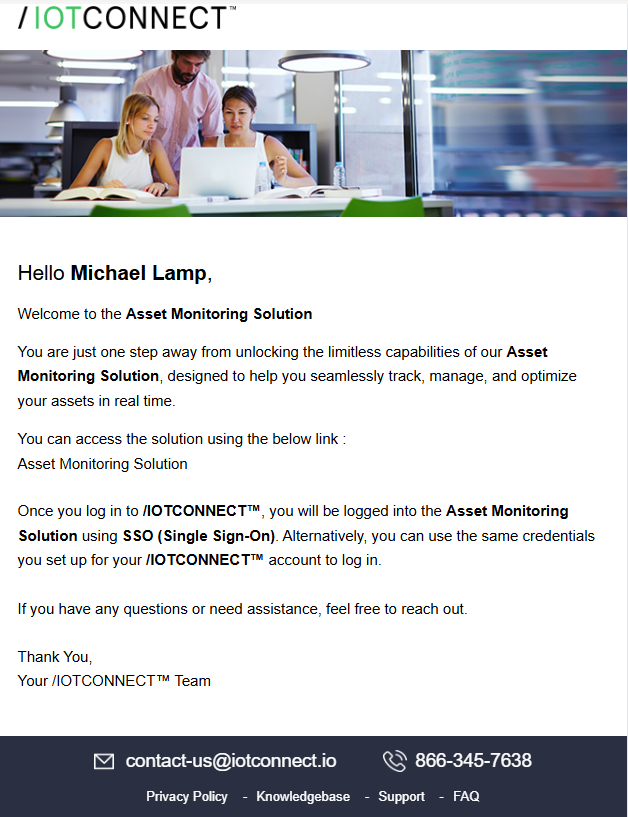

> **NOTE**
> Check your SPAM folder if the emails don't arrive within a couple of minutes.

## 3. Log in to /IOTCONNECT

Open the login page in a browser:
<https://awspoc.iotconnect.io/login>


* Enter your email and the temporary password from the second email.
* You will be redirected to a **Reset Password** page — set a new password and submit.
* Log in again with your new password.

After authentication you land on the **Company Account Dashboard**.


## 4. Connect /IOTCONNECT to ST AIoT Craft

This step links your /IOTCONNECT tenant to the ST AIoT Craft cloud so trained models can flow back from AIoT Craft into your AI Model Library.

1. Open the side menu and navigate to **Settings → Configurations**.

2. In the **Configurations** panel, under **General**, click **STAIOT** (marked **①** below). It's the fourth row under *General* — easy to miss against the panel's subtle highlight, and it sits behind the **Settings** flyout menu until you close that menu by clicking inside the Configurations panel.

   

3. On the right-hand panel, click the **+ Create Association** button (marked **②**).

   

4. A Cognito sign-in dialog opens. Choose **avnet-iotc-stage** (not *avnet-iotc-dev*).

   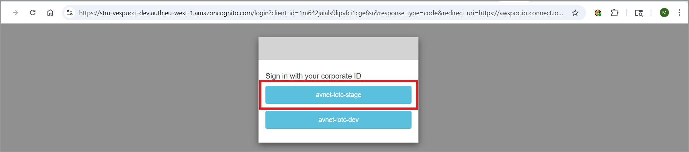

> **NOTE — Known issue**
> Occasionally an AIoT Craft training job will fail. The /IOTCONNECT and ST teams are actively addressing this. If it happens, retry the same flow with a fresh dataset.

## 5. Download the /IOTCONNECT Bridge App (Beta)

Use the QR codes below to install the Bridge App. (This is the beta build distributed via Updraft; the app-store release lands in mid-summer.)

### iOS App
URL: <http://avnet.me/iotc-ios-bridge>


### Android App
URL: <http://avnet.me/iotc-android-bridge>


After scanning the QR code, the **Updraft** distribution page opens in your browser. Tap the orange **Update** button (it reads **Install** on a first-time install) to download the app, then follow the platform-specific prompts below.


> **iOS only — "Untrusted Enterprise Developer"**
> Because the beta is distributed outside the App Store, iOS 26 will block it on first launch with the message **"Untrusted Enterprise Developer."** To trust it:
> 1. Open **Settings → General → VPN & Device Management** (may appear as **Profiles & Device Management**).
> 2. Under **Enterprise App**, tap the developer **Softweb Solutions Inc.** and tap **Trust**, then confirm.
> 3. iOS may ask you to **Allow & Restart** — let it. After reboot, complete any **"Ready to Install Profile"** prompt and tap **Done**.
> 4. Launch the Bridge App from your Home Screen.

> **Android only — "Install unknown apps" / Play Protect**
> Because the beta is distributed via Updraft (not the Play Store), Android will prompt you a couple of times before letting it install. Open the Updraft URL in **Chrome** on your phone and:
> 1. Tap **Install** on the Updraft page. Chrome will say **"For your security, your phone isn't allowed to install unknown apps from this source."** Tap **Settings**.
> 2. Toggle **Allow from this source** on for Chrome (or the browser you used). Back out — the install prompt resumes automatically.
> 3. Tap **Install** on the package installer screen.
> 4. If **Play Protect** warns *"Block harmful app?"* or *"App not approved by Play Protect,"* tap **More details → Install anyway**. The app is unsigned for the Play Store, not malicious.
> 5. When install completes, tap **Open** to launch the Bridge App from the installer, or find the icon in your app drawer.

## 6. Log in to the Bridge App

Open the **/IOTCONNECT Bridge** app and sign in.


* Use the **same credentials** you used in the browser.
* Set the environment to **`awspoc.iotconnect.io (AWS)`**.
* Tap **Login**.

## 7. Pair the SensorTile.box PRO

With the box powered on, the Bridge App scans for BLE devices automatically.


* In the **Searched bluetooth device list**, your box appears under its **unique 7-character identifier** — the same one programmed into your kit and printed on your box (the screenshot shows `IOTC4ml`; yours will be different). The Bluetooth MAC address is shown directly beneath the name.
* If the list stays empty after a few seconds, tap the green menu button in the lower-right corner and choose **Scan Device**.
* Tap your device to pair.

Tapping the device will automatically:
1. Create a device template in /IOTCONNECT (if one does not already exist for this firmware).
2. Register a new device in /IOTCONNECT keyed to your box's identifier.

Once paired, the app lands on the **AI Model List** with your device shown as **Connected** at the top.


## 8. Verify the Device in /IOTCONNECT

Switch back to the browser and confirm the device showed up.

* From the left menu open **Devices → Device** — click the **Devices** icon in the far-left nav bar (**①**), then **Device** in the flyout (**②**).

  

* Your device is the only row in the table. The **Provisioning Status (①)** reads **CONNECTED** while the Bridge App is actively bridging, and flips to **DISCONNECTED** once the app disconnects (e.g. it's backgrounded or you closed it) — the screenshot below shows the disconnected state. Click the device's **Unique ID (②)** to open its Device Info page.

  

## 9. Verify the Template

The Bridge App also auto-creates the **AvnetSTaws** template if it isn't already there. Templates are easy to miss — from the **Device Info** page you opened in Step 8, click **Templates** in the toolbar along the bottom of the page (boxed in red below).


From **Templates** you can confirm the **AvnetSTaws** template exists, has File Upload enabled (so the Bridge App can ship logging sessions to /IOTCONNECT), and exposes the SensorTile attribute set. To open it, click the **Edit (pencil) icon** in the **Actions** column on the **AvnetSTaws** row.


* This opens its **Properties** — note **Enable File Support** is on (highlighted below). With this toggled on, the device can securely upload data files to /IOTCONNECT — that's what lets you ship the labeled sensor sessions you'll capture in the training half of this workflow up to the cloud for AIoT Craft to train on.

  

* …and its **Attributes** (49 sensor attributes — accel, gyro, RMS speed, MLC features, etc.). Many of these aren't used in this workflow; they're the full set of sensor attributes defined by the [BlueST-SDK](https://www.st.com/en/embedded-software/bluest-sdk.html). To exercise the full attribute set on the same SensorTile.box PRO, run the [mobile app guide](./mobile_app_guide.md), which walks through flashing a BlueST-SDK firmware build that exposes them.

  

## 10. Push the Smart Asset Tracking Model

/IOTCONNECT ships with four ready-to-run starter models in the **Model Library**. These are the same format AIoT Craft produces, so once you've walked the loop with one of them you've already seen the deployment story end-to-end. **For this walkthrough, push the Smart Asset Tracking model** — it's the one Step 11 and the dashboard in Step 12 are wired up for.

| Starter model | What it detects |
|---|---|
| **Gesture Recognition** | Hand & wrist motion patterns |
| **Head Gesture Recognition** | Nod, shake, tilt — wearables |
| **Human Activity Recognition** | Walking, running, stationary, fall |
| **Smart Asset Tracking** ← use this one | Stationary upright / not upright, motion, shaken |

To deploy **Smart Asset Tracking** to your box, open **AI Models → Push Model** from the left sidebar (**①** the AI Models icon, then **②** Push Model).


Fill in the **Push Model** form (numbered overlays in the screenshot below):


1. **Model** — pick **Smart Asset Tracking**.
2. **Version** — leave it at the latest (e.g. `1.0.0`).
3. **Device Template** — pick **AvnetSTaws**.
4. **Select Device** — switch to **Selected devices** (not *All devices of selected entity*), then pick your device from the **Select Device** dropdown.
5. Click the **Push Model** button.

The Bridge App receives the OTA over BLE and writes the model to the SensorTile.box PRO's Machine Learning Core.

> **TIP — Try the other models later**
> Once you've finished this walkthrough with **Smart Asset Tracking**, come back to this step and push one of the other starter models (*Gesture Recognition*, *Head Gesture Recognition*, *Human Activity Recognition*) to see a different set of classifications stream into the same Bridge App and dashboard. Each model targets the same `AvnetSTaws` template, so no rewiring needed — just **Push Model** again and tap the new card in the AI Model List.

## 11. View Live Inference on the Phone

After pairing, the Bridge App lands on the **AI Model List** screen, which lists the models available for your device, each with a radio button. Tap **Smart Asset Tracking** to select it — its radio fills green and the row is highlighted (as in the screenshot below). If it isn't listed, redeploy the model from Step 10.

Then tap **Run Inference** at the bottom (highlighted in red below). The app pushes the device into inference mode and starts streaming MLC results.


The app then downloads the model bundle (if not already cached) and applies the configuration to the box:

| | |
|---|---|
|  |  |
| Downloading | Applying Config |

For *Smart Asset Tracking*, the four classes light up in real time as you pose the box:

| | | | |
|---|---|---|---|
|  |  |  |  |
| Stationary Upright | Stationary Not Upright | Motion | Shaken |

> **NOTE — iOS and Android differ on this screen**
> The inference screenshots above are from the **iOS** app. The **Android** app shows the same four classifications with a different layout, so your screen may not match pixel-for-pixel — the class labels (*Stationary Upright*, *Stationary Not Upright*, *Motion*, *Shaken*) and the behavior are identical.

The inference classifications stream to /IOTCONNECT, ready for the dashboard in the next step.

> **Two modes — only one produces data at a time**
> The SensorTile.box PRO runs in **one of two modes** at any moment, and **only the active mode produces data** — the other mode's attributes stay **null** in /IOTCONNECT:
> - **Inference mode** (**Run Inference**, this step) → the MLC **classification** attributes update; the raw accelerometer / gyroscope attributes are null.
> - **Data-logging mode** (**Data Logging**) → the raw **sensor** attributes update; the inference attributes are null.
>
> So the dashboard you build next shows live **inference** results while you're in inference mode. To see raw accel / gyro values populate instead, you switch the box into data-logging mode — that's the capture flow in **Step 13**.

## 12. Create a Dashboard

Dynamic Dashboards visualize live telemetry, inference history, and any other attribute attached to your device template. While you're in inference mode the dashboard shows live classifications; the raw sensor-data widgets stay empty until the box is in data-logging mode (see the note above).

* Download the [ST AIoT Craft dashboard template](https://iotcimage.s3.us-east-1.amazonaws.com/dashboards/STMicro/aiotcraft/ST_AIoT_CraftDashboard.json) (right-click and **Save As…**).
* In /IOTCONNECT, click **+ Create Dashboard** at the top of the page (**①** below). In the dialog that opens, select the **Import Dashboard** radio button (**②**), then **Browse** to the saved `.json` file.

  

* Once the file uploads, additional fields appear. Fill them in:

  1. **Template** = `AvnetSTaws`
  2. **Device** = your unique device
  3. **Dashboard Name** = e.g. `ST AIoT Craft -ml4- SensorTile.Box Pro`
  4. Leave **Only Visible to Me** checked if you don't want to share within your account
  5. Pick a **Background Color** (e.g. `EEEEEE`)
  6. Click **Save**

  

* The dashboard opens in **Edit Mode** with the imported widgets and a widget palette. Drop in additional widgets if you like, or click **Save** in the top-right (highlighted below) to exit edit mode.

  

* Find your dashboard later under **Dashboards** in the top middle of the page.

The finished view groups the widgets into **Inference Mode Telemetry** (Smart Asset Monitoring, Inference History) and **Data Logging Telemetry** (Device Log, All Telemetry), alongside Alerts and Notifications — all bound to the device you just paired.


> **NOTE — only one section produces data at a time**
> **①** **Inference Mode Telemetry** populates only when **Run Inference** is selected in the Bridge App.
> **②** **Data Logging Telemetry** populates only when **Data Logging** is selected.

> **TIP**
> The dashboard supports five management actions from the top bar: **Refresh Data**, **Edit Mode**, **Delete**, **Share Link** (no login required), and **Export to JSON** (handy when onboarding another device). You can also confirm raw data flow by clicking **Live Data** on the device's Device Info page.
>
> 

> **NOTE — Built-in quick-reference panel**
> The imported dashboard already includes a quick-reference panel on the right (shown below) explaining the two telemetry modes — it's part of the template, so there's nothing to add yourself.
>
> 

**Widgets in this dashboard**

The imported template mixes several widget types — each is a configurable building block you can re-style, reposition, or replicate:

- **Image** — static or classification-driven images (the AIoT Craft title banner).
- **Label** — colored section headers (`INFERENCE MODE TELEMETRY`, `DATA LOGGING TELEMETRY`).
- **HyperLink** — button-style external links (SensorTile.box PRO, ST AIoT Craft, CAD Resources, Tools & Software, ST MEMS Community, /IOTCONNECT).
- **Telemetry** — live key/value table for the device's attributes (All Telemetry).
- **LiveLineChart** — time-series chart of one or more numeric attributes (Device Log — `accel_x / y / z`).
- **Transformation** — display tied to a calculation or classification (Smart Asset Monitoring — image varies with `inference_state`).
- **pie** — pie chart aggregating recent values (Inference History).
- **Notifications** — recent rule-triggered alerts for the device (the Notifications panel — populates after you create a Rule in the optional step below).
- **lastrefreshed** — timestamp of the dashboard's last data pull (Last Refreshed).

**Editing the Dashboard**

To customize a widget — change its title, swap colors, or add a new one — switch into **Edit Mode**.

1. From the live dashboard, click the **pencil (Edit Mode)** icon at the top-right (highlighted below).

   

2. Edit Mode adds **Save** / **Cancel** at the top-right and opens the **All widgets** palette at the bottom — drag any widget from the palette onto the canvas to add a new one (highlighted below).

   

3. Click the **⋮ (three-dot)** menu on any widget and choose **Settings** to open the **Widget Settings** panel. For simple widgets like **Label** you get **Background**, **Title Name**, and **Font Color / Style / Size** — adjust what you need and click **Apply** (highlighted below).

   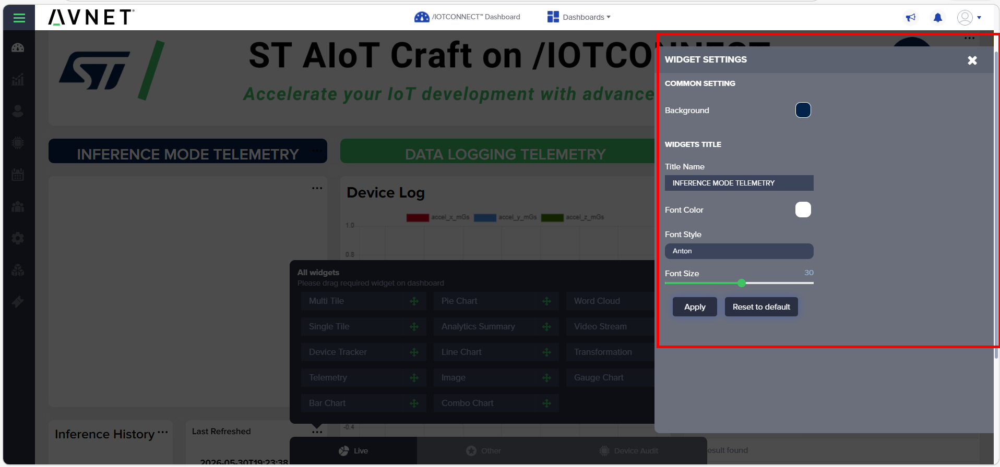

4. Data widgets (**Telemetry**, **LiveLineChart**, **Transformation**) also show a **WIDGETS CONTENT** panel on the right — pick the device and tick the sensor attributes the widget should display (highlighted below).

   

When you're done, click **Save** at the top-right to persist your changes (or **Cancel** to discard them).

## (Optional) Create a Rule & Alert

The dashboard's **Alerts** and **Notifications** widgets stay empty until a **Rule** fires. A Rule watches an attribute (like `inference_state`) and raises an alert when a condition is met — for example, notify you whenever the box reports **shaken**. This step is optional, but it shows how an inference result can drive automation.

1. **Open Rules.** From the device area, click **Rules** in the toolbar along the bottom of the page.

   

2. **Start a new rule.** The Rules page is empty to begin with — click **Create Rule** at the top right.

   

3. **Define the rule** (numbered overlays below):
   1. **Rule name** — e.g. `Product damaged`.
   2. **Template** — `AvnetSTaws`.
   3. **Severity levels** — e.g. `Critical`.
   4. **Rule type** — choose **Smart Rule**.
   5. **Conditions** — enter a condition on an attribute, e.g. `inference_state = "shaken"`. Use the **Select Attributes** list on the right to insert `inference_state`, then click **Verify**.

   

   Under **Rule Applies On**, choose **Selected Devices** and pick your device.

4. **Choose how you're notified, then save** (numbered overlays below):
   1. Under **Notification Type**, open the **UI Alert** tab and toggle **Enable** on.
   2. Under **Audience → Users**, select yourself so the alert reaches you.
   3. Click **Save**.

   

With the box in inference mode (**Run Inference**), **shake it**. When `inference_state` hits `shaken`, the rule fires and the alert appears in the **Notifications** widget on your dashboard (and under the bell icon in the top bar).

## 13. Capture Labeled Sensor Data for Training

This is the half of the loop that feeds **ST AIoT Craft**. Logging mode swaps the device out of inference and streams raw sensor samples into a session that gets zipped and uploaded to /IOTCONNECT.

* From the Bridge App's **AI Model List**, tap **Data Logging**.
* Choose the sensor(s) you want to record (e.g. **Accelerometer**, **Gyroscope**) and tap **Start**.

  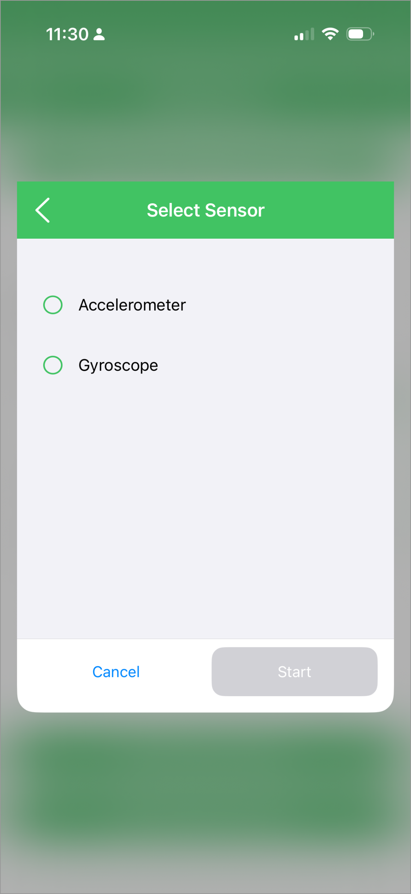

* On the next screen, pick the **labels** you want to associate with this session. The app shows a live chart of the sensor stream so you can confirm signal before recording.

  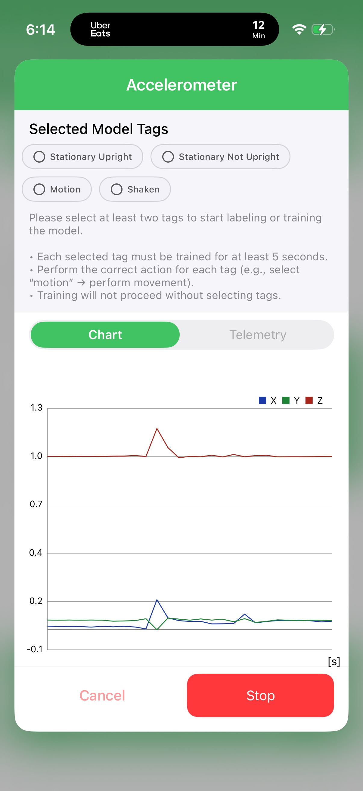

* Press **Start** and perform each motion/activity for the duration you want it labeled. When done, press **Stop**.

  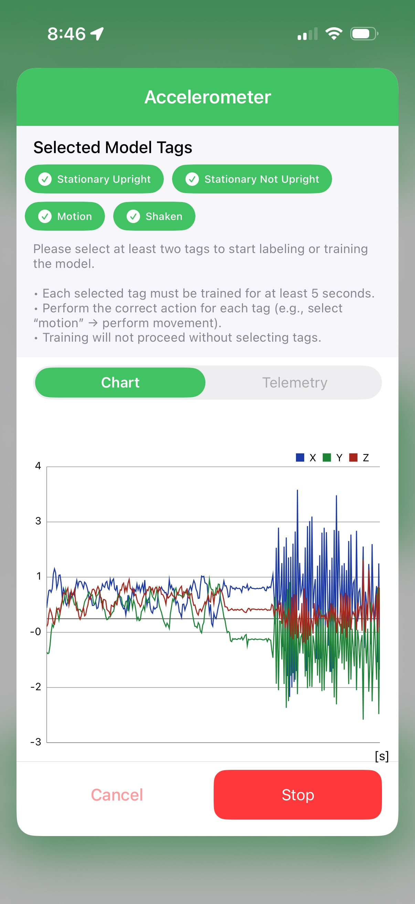

> **Labeling — 4 Simple Rules**
> 1. **Pick at least 2 labels.** Single-label training fails with "job failed" — this is the #1 cause.
> 2. **At least 5 seconds per label.** Less than 5s → no association → upload may parse but training will reject it.
> 3. **Multiple labels can overlap.** If you press *Shaken* and then press *Motion* without releasing *Shaken*, both get entries in `acquisition_info.json`. The first label is **not** auto-released — overlap is intentional.
> 4. **Re-pressing a label that already logged is ignored.** If you select *Shaken*, log it, deselect, then re-select *Shaken*, the second selection adds nothing — the cloud already has *Shaken* data for this session.

Stopping the session leaves the labeled data on the SensorTile.box PRO's microSD card — it does **not** auto-upload. **Step 14** walks through pushing it to /IOTCONNECT so AIoT Craft can train on it.

## 14. Push Samples to /IOTCONNECT

To kick off training, the session files have to move from the device's microSD card up to /IOTCONNECT. The Bridge App's **SD Card** screen walks you through it.

1. **Stop training.** Confirm you're back at the *Accelerometer* screen with logging stopped and your tags still selected.

   

2. **Find the log folder.** Open the **SD Card** section in the Bridge App. You'll see a "Follow these steps" help screen explaining the dongle workflow.

   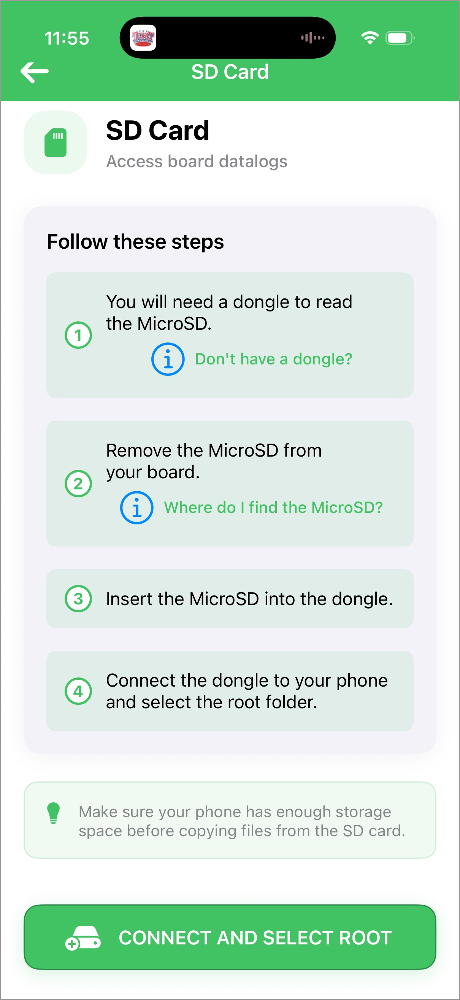

3. **Plug in the SD card.** Power down the box, pop the microSD out, slot it into a USB-C / Lightning microSD dongle, and connect the dongle to your phone. Tap **Connect and Select Root**, grant access, and browse to the `STM32` folder — each logging session is a date-named folder (e.g. `20260429_21_30_06`).

   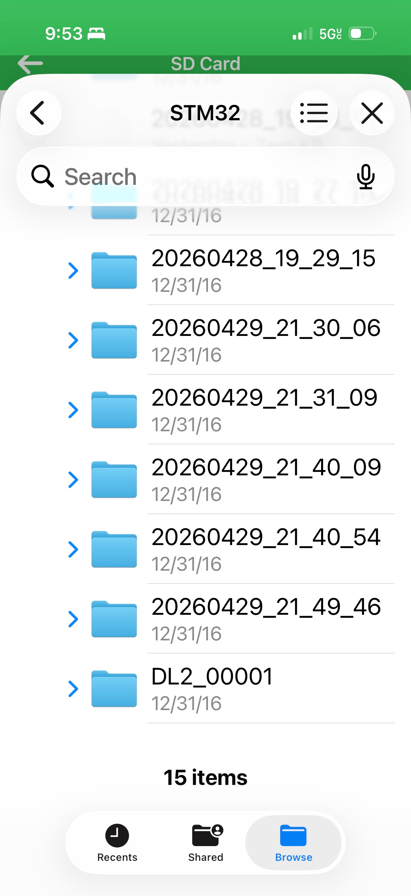

4. **Select / push the files.** Open the most recent session folder, tick all three files (`acquisition_info.json`, `device_config.json`, and `lsm6dsv16x_acc.dat` / `_gyro.dat`), and push.

   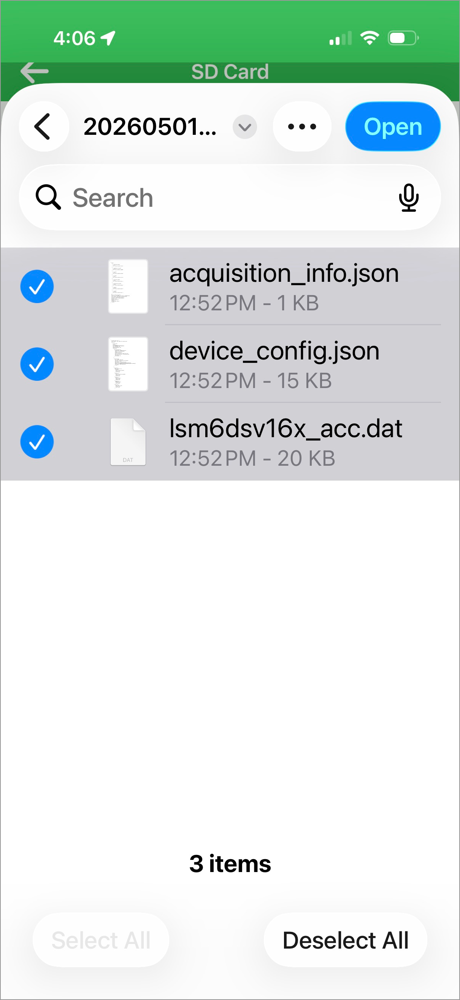

5. **Upload Success.** When the bundle has been zipped and accepted by /IOTCONNECT, the app shows an **Upload Success** confirmation. The session is now queued for AIoT Craft to consume.

   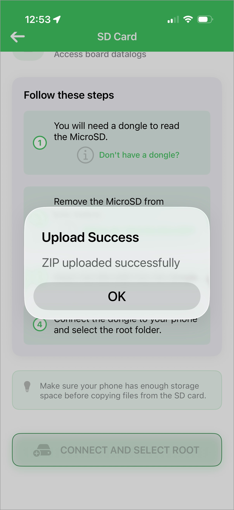

> **NOTE**
> The upload is the trigger for AIoT Craft to start training. If a session never makes it into /IOTCONNECT, no `.ucf` model will come back — make sure each labeled session ends with the **Upload Success** popup.

## 15. Inspect a Logged Session

Each session is a folder on the device's SD card (and a zip in /IOTCONNECT) containing three artifacts:

| | |
|---|---|
|  | 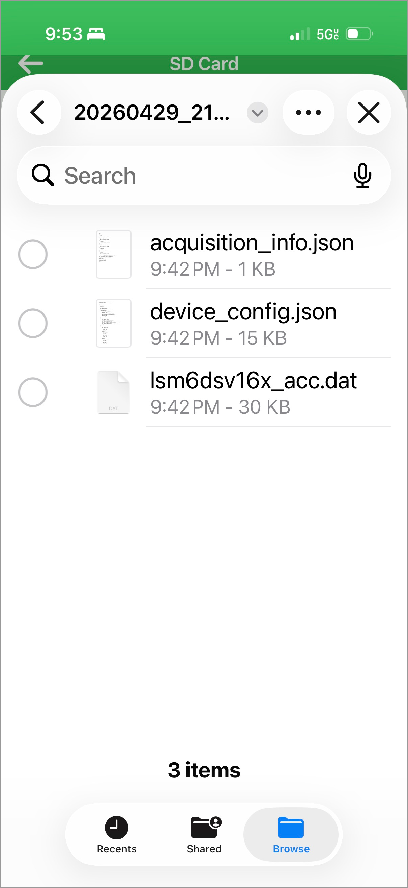 |

* **`acquisition_info.json`** — every label you pressed, with start/stop timestamps. The cloud uses this to slice the raw `.dat` files into labeled chunks.
* **`device_config.json`** — sensor configuration (ODR, full-scale, enabled axes) at recording time. The cloud needs this to interpret the binary correctly.
* **`lsm6dsv16x_acc.dat` / `lsm6dsv16x_gyro.dat`** — raw binary samples, parsed and chunked into CSV by AIoT Craft.

To find the upload in /IOTCONNECT, open your device's Device Info page and click the **Telemetry Files** tab. Each row is one logging session with timestamp, size, and a download link.

> **NOTE**
> If a freshly stopped session doesn't appear immediately, give it a minute — the upload happens after the session closes, not during recording.

## 16. The MLC Retraining Loop

Once one or more labeled sessions are sitting in /IOTCONNECT, the connector you set up in **Step 4** forwards the binary HSD data to ST AIoT Craft, which runs AutoML / AFS to produce a `.ucf` MLC model. AIoT Craft pushes that model **back** into your account's AI Model Library, and a single **Push Model** click delivers it to the device:

```
[Device]            [BLE]      [Bridge App]   [/IOTCONNECT]   [Connector]   [ST AIoT Craft]
   │                  │             │              │              │              │
   │ MLC inference ──►│ ───────────►│ Telemetry    │              │              │
   │                  │             │ ───────────► │ Stored as    │              │
   │                  │             │              │ template     │              │
   │ Switch→logging ◄─┤ ◄───────────┤ Cmd from     │              │              │
   │ datalog2 firmware│             │ cloud        │              │              │
   │                  │             │              │              │              │
   │ Raw .dat + JSON ►│ ───────────►│ Zip + upload │              │              │
   │                  │             │ ───────────► │ Forward via  │              │
   │                  │             │              │ connector ──►│ Blob ingest  │
   │                  │             │              │              │ (binary-hsd) │
   │                  │             │              │              │ ───────────► │ Chunks (CSV)
   │                  │             │              │              │              │ AutoML / AFS
   │                  │             │              │              │              │ trains MLC
   │                  │             │              │              │ ◄────────────┤ .ucf model
   │                  │             │              │ Model ◄──────┤              │
   │                  │             │              │ registered   │              │
   │                  │             │              │ in library   │              │
   │ load_model PnPL ◄┤ ◄───────────┤ Push model   │              │              │
   │ command          │             │ (OTA)        │              │              │
   │                  │             │              │              │              │
   │ MLC reprogrammed,│             │              │              │              │
   │ inference resume►│ ───────────►│ ───────────► │ Live again   │              │
```

To verify a freshly trained model:

1. /IOTCONNECT → **AI Models → Push Model** → select your new model → **Push**.
2. In the Bridge App, return to **AI Model List** (if connected the new model appears) and tap **Run Inference** to switch the box back into inference mode.
3. Watch the dashboard — your model is now running on real hardware.

> **Capture → Upload → Train → Deploy → Inference → (capture more) → Retrain**

## 17. Find Your Trained Model in /IOTCONNECT

When AIoT Craft finishes training (typically ~30 seconds after the upload is accepted), a new entry appears in your AI Model library — distinct from the read-only **Model Library** used in **Step 10**, this is the **My Model** list of models trained on your own data.

1. From the left menu open **AI Models → AI Model**.

   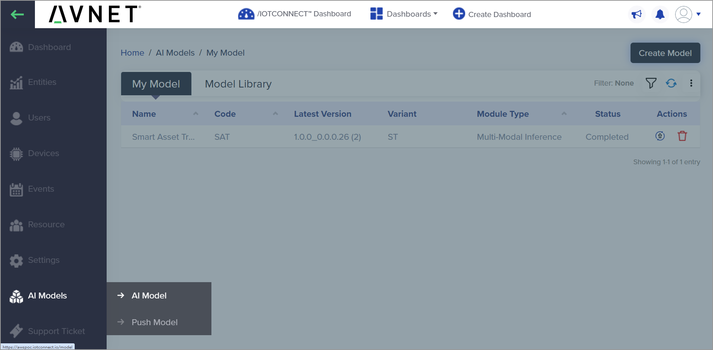

2. Your trained model shows up in the **My Model** tab as soon as training completes — typically within ~30 seconds. Status reads **Completed** when it's ready to push.

   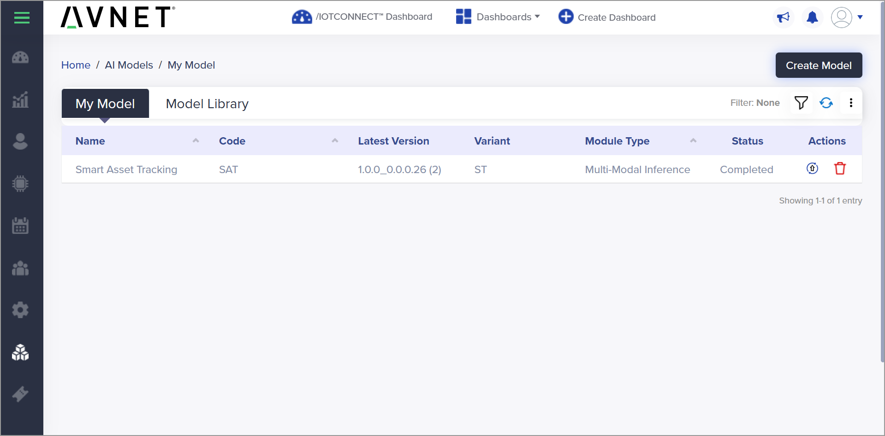

3. Click the version number to see every training run AIoT Craft has produced for this model — useful when you've captured multiple datasets and want to compare or roll back.

   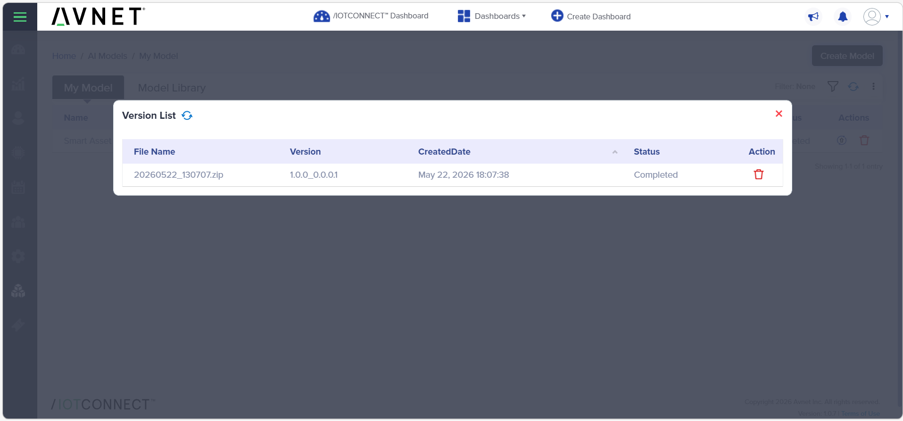

> **NOTE**
> If the model doesn't appear within a couple of minutes, check that the STAIOT association from **Step 4** is still active and that the upload completed (Step 14 ended in **Upload Success**). The single-label-fails / under-5-second rules from **Step 13** also surface here as a *job failed* status.

From this point, deploying the model is the same one-click **Push Model** flow you used in **Step 10** — except the model is now the one trained on your own data.

## 18. The 5 Stages — End-to-End

Putting the whole loop on one page:

| Stage | Time | What you did | Section |
|---|---|---|---|
| **1. Connect** | ~10 min | Account · device register · BLE pair | Steps 1–8 |
| **2. Deploy a model** | ~10 min | OTA push a starter model · live inference on device | Steps 9–11 |
| **3. Capture data** | ~15 min | Switch into logging mode · record labeled sessions · push samples via dongle | Steps 12–15 |
| **4. Train & redeploy** | ~15 min | AIoT Craft trains a model · find it under My Model · OTA back · see your model run | Steps 16–17 |

## Optional — Build Your Own Custom Experiences

/IOTCONNECT exposes everything used in this guide via REST and AWS-native connectors:

* REST API docs: <https://docs.iotconnect.io/iotconnect/rest-api/>
* Swagger (POC): <https://awspocmaster.iotconnect.io/api/v2.1/swagger-json>
* AWS connectors: S3, DynamoDB, SNS, SageMaker, Kinesis, Lambda, Greengrass, EventBridge, Grafana

Webhooks for inbound events, OAuth 2.0 across the API, and CI/CD-friendly OTA triggers mean every step in this guide can be scripted.

## See Also

* [Main Mobile App Guide](./mobile_app_guide.md) — the production AWS flow with `BLESensorsPnPL.bin` / `STSW-MKBOXPRO_1_1_1.bin` firmwares
* [SensorTile.box PRO Getting Started Guide](https://www.st.com/resource/en/user_manual/um3133-getting-started-with-sensortilebox-pro-multisensors-and-wireless-connectivity-development-kit-for-any-intelligent-iot-node-stmicroelectronics.pdf) — DFU mode, hardware reference
* [/IOTCONNECT Product Updates](https://docs.iotconnect.io/iotconnect/platform/product-updates/) — AIoT Craft GA timeline
