f# Lab 1 — Deploy a Starter MLC Model   /IOTCONNECT Bridge App + ST SensorTile.box PRO + ST AIoT Craft

This is the first of two labs. **Lab 1 takes you from zero to a pre-built AI model running on the SensorTile.box PRO**, with live inference streaming to the Bridge App on your phone and a /IOTCONNECT dashboard visualizing the inference results. **[Lab 2](./st_aiotcraft_lab2_train.md)** picks up from there: capture your own labeled sensor data, train a custom MLC model with ST AIoT Craft, and OTA it back to the device.

> **NOTE**
> This guide tracks the **AWS POC** instance of /IOTCONNECT (the environment used for the ST AIoT Craft preview). Production release is planned for mid-summer; release notes are tracked at <https://docs.iotconnect.io/iotconnect/platform/product-updates/>. Where the [main mobile app guide](./mobile_app_guide.md) covers the production AWS environment, **use the URLs in this guide** for the AIoT Craft flow.

## Prerequisites

In addition to the ST SensorTile.box PRO, you will need:

- A **/IOTCONNECT POC** account — you will create this in Step 1
- An Android or iOS device (acts as the BLE-to-WAN bridge), **updated to the latest OS** — iOS **26.5** (any iPhone 11 or newer) or the latest Android version your device offers. Please update before the workshop; the preview Bridge App is tuned for current OS versions.
- A SensorTile.box PRO running **FP-SNS-DATALOG2_Datalog2 v3.1.0** firmware (this is the version AIoT Craft expects; the kits handed out for the lab ship pre-flashed) — see the [Engineering Note](./st_aiotcraft_engineering_note.md) for why this exact version matters across hardware revisions and phone platforms
- The 7-character identifier printed on the back of your SensorTile.box PRO — you will use it to pick the right device out of the BLE list
- Desire to learn!

> **NOTE**
> If you need to (re)flash the SensorTile.box PRO yourself, refer to Chapter 2.2 of the [SensorTile.box PRO Getting Started Guide](https://www.st.com/resource/en/user_manual/um3133-getting-started-with-sensortilebox-pro-multisensors-and-wireless-connectivity-development-kit-for-any-intelligent-iot-node-stmicroelectronics.pdf) for DFU instructions and the [STM32CubeProgrammer](https://www.st.com/en/development-tools/stm32cubeprog.html). The flow in this guide assumes the datalog2 firmware is already on the box.

## 1. Subscribe to /IOTCONNECT

Open the /IOTCONNECT POC subscription page:
[https://avnet.me/IOTC-4-ST](https://avnet.me/IOTC-4-ST) (resolves to <https://pocsubscription.iotconnect.io/registration>).

* Pick the **Trial** plan (1 month free, no credit card required) and click **Subscribe Now**.

Complete the registration form:

> **IMPORTANT — your company name must be globally unique**
> Two fields on this form must be unique across the **entire shared /IOTCONNECT instance**, and **registration fails if either is already taken**:
> - **Email** → becomes the **account owner** (full admin permissions).
> - **Company name** → becomes your account's permanent unique identifier (CPID).
>
> Because everyone in the room registers against the same instance, a plain name like `Avnet` is already taken. **Append something unique to yourself** — your initials or a number works well:
>
> | Don't | Do |
> |---|---|
> | `Avnet` | `Avnet-MJL` |
> | `STMicro` | `STMicro-lab28` |
>
> If the form rejects your entry, change the **company name** (and/or use a different email alias) and resubmit.

## 2. Receive Account Information Emails

After submitting registration, expect two emails from /IOTCONNECT:

| | |
|---|---|
|  |  |
| **Welcome to /IOTCONNECT** — plan info and the green **VIEW /IOTCONNECT** button that takes you to the login page. | **Temporary password** — single-use, you'll be forced to reset it on first login. |

> **NOTE**
> Check your SPAM folder if the emails don't arrive within a couple of minutes.

## 3. Log in to /IOTCONNECT

Open the login page in a browser:
<https://awspoc.iotconnect.io/login>

* Enter your email and the temporary password from the second email.
* You will be redirected to a **Reset Password** page — set a new password and submit.
* Log in again with your new password.

After authentication you land on the **Company Account Dashboard**.

## 4. Connect /IOTCONNECT to ST AIoT Craft

This step links your /IOTCONNECT tenant to the ST AIoT Craft cloud so trained models can flow back from AIoT Craft into your AI Model Library. You will not see the payoff of this association until **Lab 2**, but it has to be in place before you start uploading training data.

1. Open the side menu and navigate to **Settings → Configurations**.

2. In the **Configurations** panel, under **General**, click **STAIOT** (marked **①** below). It's the fourth row under *General* — easy to miss against the panel's subtle highlight, and it sits behind the **Settings** flyout menu until you close that menu by clicking inside the Configurations panel.

   

3. On the right-hand panel, click the **+ Create Association** button (marked **②**).

   

4. A Cognito sign-in dialog opens. Choose **avnet-iotc-stage** (not *avnet-iotc-dev*).

   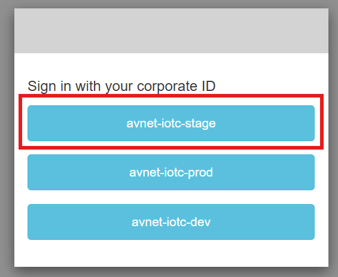

## 5. Download the /IOTCONNECT Bridge App (Beta)

Use the QR codes below to install the Bridge App. (This is the beta build distributed via Updraft; the app-store release lands in mid-summer.)

### iOS App
URL: <http://avnet.me/iotc-ios-bridge>

### Android App
URL: <http://avnet.me/iotc-android-bridge>

After scanning the QR code, the **Updraft** distribution page opens in your browser. Tap the orange **Update** button (it reads **Install** on a first-time install) to download the app, then follow the platform-specific prompts below.

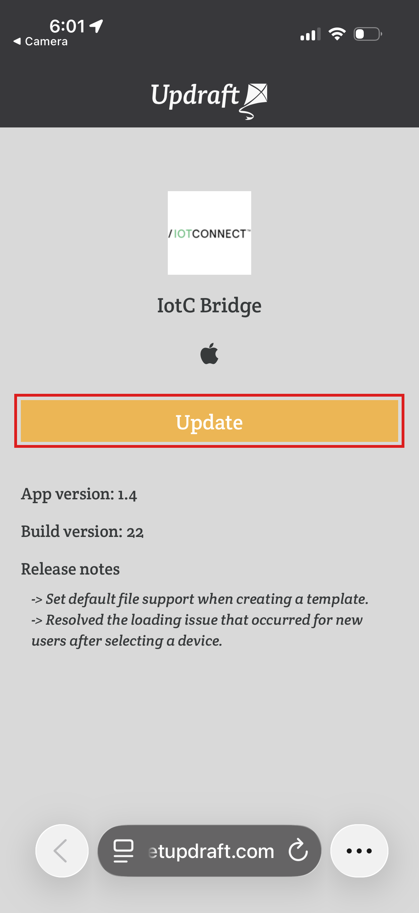

> **iOS only — "Untrusted Enterprise Developer"**
> Because the beta is distributed outside the App Store, iOS 26 will block it on first launch with the message **"Untrusted Enterprise Developer."** To trust it:
> 1. Open **Settings → General → VPN & Device Management** (may appear as **Profiles & Device Management**).
> 2. Under **Enterprise App**, tap the developer **Softweb Solutions Inc.** and tap **Trust**, then confirm.
> 3. iOS may ask you to **Allow & Restart** — let it. After reboot, complete any **"Ready to Install Profile"** prompt and tap **Done**.
> 4. Launch the Bridge App from your Home Screen.

> **Android only — "Install unknown apps" / Play Protect**
> Because the beta is distributed via Updraft (not the Play Store), Android will prompt you a couple of times before letting it install. Open the Updraft URL in **Chrome** on your phone and:
> 1. Tap **Install** on the Updraft page. Chrome will say **"For your security, your phone isn't allowed to install unknown apps from this source."** Tap **Settings**.
> 2. Toggle **Allow from this source** on for Chrome (or the browser you used). Back out — the install prompt resumes automatically.
> 3. Tap **Install** on the package installer screen.
> 4. If **Play Protect** warns *"Block harmful app?"* or *"App not approved by Play Protect,"* tap **More details → Install anyway**. The app is unsigned for the Play Store, not malicious.
> 5. When install completes, tap **Open** to launch the Bridge App from the installer, or find the icon in your app drawer.

## 6. Log in to the Bridge App

Open the **/IOTCONNECT Bridge** app and sign in.

* Use the **same credentials** you used in the browser.
* Set the environment to **`awspoc.iotconnect.io (AWS)`**.
* Tap **Login**.

## 7. Pair the SensorTile.box PRO

With the box powered on, the Bridge App scans for BLE devices automatically.

* In the **Searched bluetooth device list**, your box appears under its **unique 7-character identifier** — the same one programmed into your kit and printed on your box (the screenshot shows `IOTC4ml`; yours will be different). The Bluetooth MAC address is shown directly beneath the name.
* If the list stays empty after a few seconds, tap the green menu button in the lower-right corner and choose **Scan Device**.
* Tap your device to pair.

Selecting your device will automatically:
1. Create a device template in /IOTCONNECT (if one does not already exist for this firmware).
2. Register a new device in /IOTCONNECT keyed to your box's identifier.

Once paired, the app lands on the **AI Model List** with your device shown as **Connected** at the top.

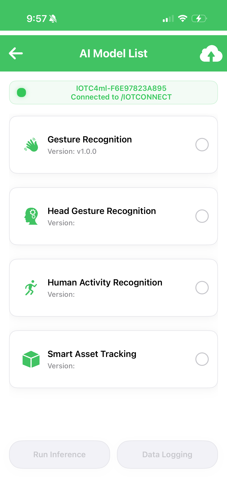

## 8. Verify the Device in /IOTCONNECT

Switch back to the browser and confirm the device showed up.

* From the left menu open **Devices → Device** — click the **Devices** icon in the far-left nav bar (**①**), then **Device** in the flyout (**②**).

  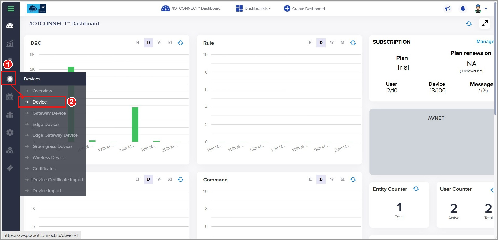

* Your device is the only row in the table. The **Provisioning Status (①)** reads **CONNECTED** while the Bridge App is actively bridging, and flips to **DISCONNECTED** once the app disconnects (e.g. it's backgrounded or you closed it) — the screenshot below shows the disconnected state. Click the device's **Unique ID (②)** to open its Device Info page.

  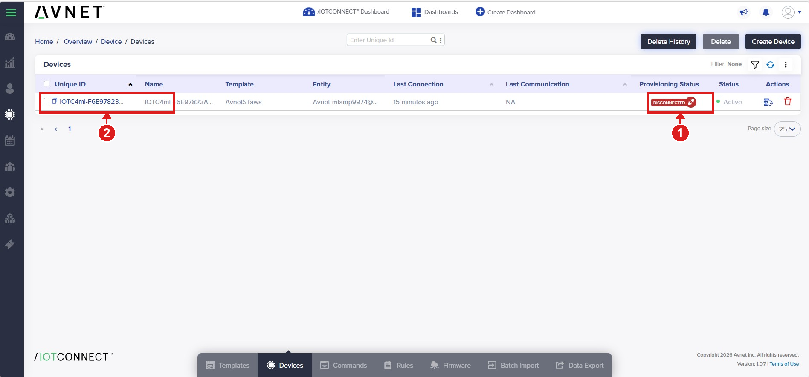

## 9. Verify the Template

The Bridge App also auto-creates the **AvnetSTaws** template if it isn't already there. Templates are easy to miss — from the **Device Info** page you opened in Step 8, click **Templates** in the toolbar along the bottom of the page (boxed in red below).

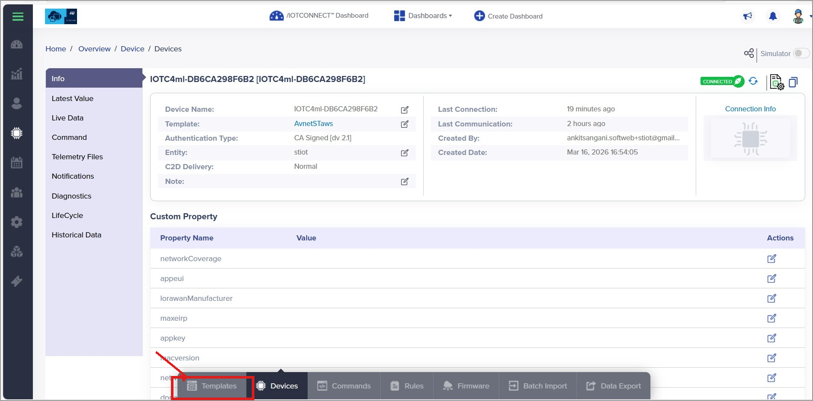

From **Templates** you can confirm the **AvnetSTaws** template exists, has File Upload enabled (so the Bridge App can ship logging sessions to /IOTCONNECT), and exposes the SensorTile attribute set. To open it, click the **Edit (pencil) icon** in the **Actions** column on the **AvnetSTaws** row.

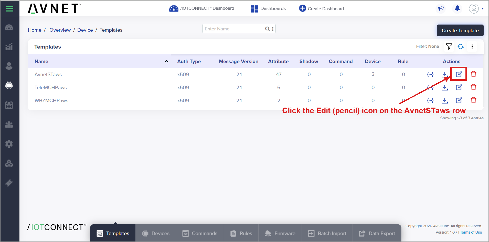

* This opens its **Properties** — note **Enable File Support** is on (highlighted below). With this toggled on, the device can securely upload data files to /IOTCONNECT — that's what lets you ship the labeled sensor sessions you'll capture in **[Lab 2](./st_aiotcraft_lab2_train.md)** up to the cloud for AIoT Craft to train on.

  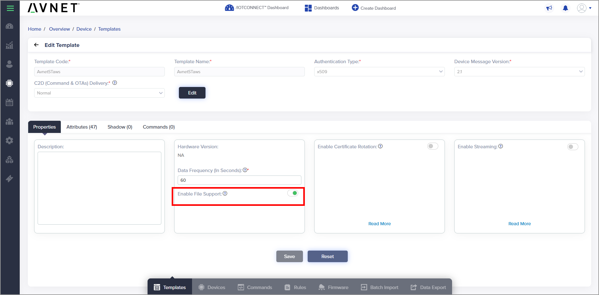

* …and its **Attributes** (49 sensor attributes — accel, gyro, RMS speed, MLC features, etc.). Many of these aren't used in this lab; they're the full set of sensor attributes defined by the [BlueST-SDK](https://www.st.com/en/embedded-software/bluest-sdk.html). To exercise the full attribute set on the same SensorTile.box PRO, run the [mobile app guide](./mobile_app_guide.md), which walks through flashing a BlueST-SDK firmware build that exposes them.

  

## 10. Push the Smart Asset Tracking Model

/IOTCONNECT ships with four ready-to-run starter models in the **Model Library**. These are the same format AIoT Craft produces, so once you've walked the loop with one of them you've already seen the deployment story end-to-end. **For this lab, push the Smart Asset Tracking model** — it's the one Step 11 and the dashboard in Step 12 are wired up for.

| Starter model | What it detects |
|---|---|
| **Gesture Recognition** | Hand & wrist motion patterns |
| **Head Gesture Recognition** | Nod, shake, tilt — wearables |
| **Human Activity Recognition** | Walking, running, stationary, fall |
| **Smart Asset Tracking** ← use this one | Stationary upright / not upright, motion, shaken |

To deploy **Smart Asset Tracking** to your box, open **AI Models → Push Model** from the left sidebar (**①** the AI Models icon, then **②** Push Model).

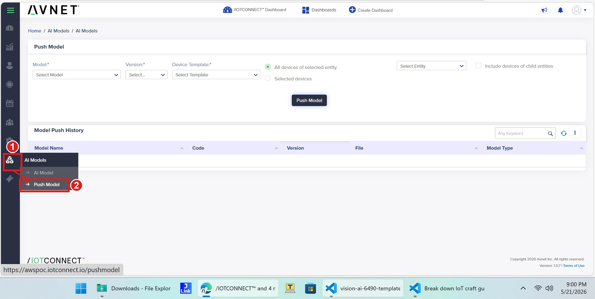

Fill in the **Push Model** form (numbered overlays in the screenshot below):

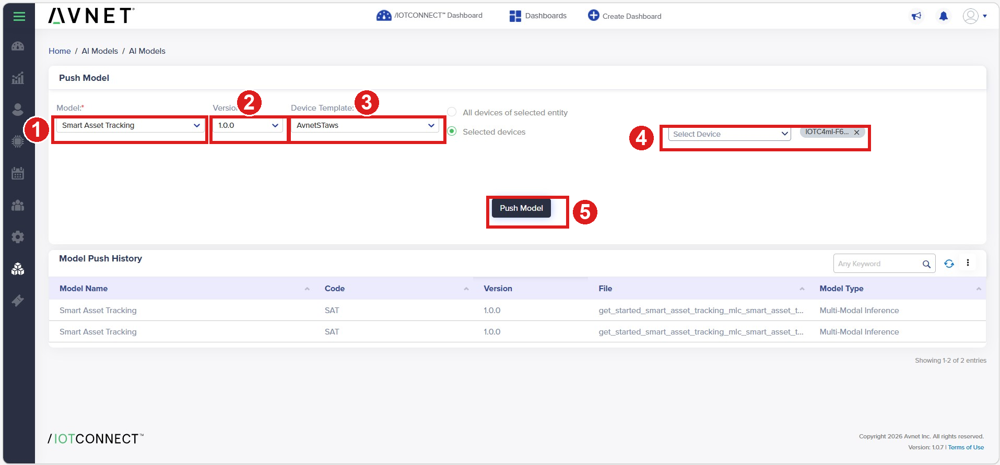

1. **Model** — pick **Smart Asset Tracking**.
2. **Version** — leave it at the latest (e.g. `1.0.0`).
3. **Device Template** — pick **AvnetSTaws**.
4. **Select Device** — switch to **Selected devices** (not *All devices of selected entity*), then pick your device from the **Select Device** dropdown.
5. Click the **Push Model** button.

The Bridge App receives the OTA over BLE and writes the model to the SensorTile.box PRO's Machine Learning Core.

> **TIP — Try the other models later**
> Once you've finished Lab 1 with **Smart Asset Tracking**, come back to this step and push one of the other starter models (*Gesture Recognition*, *Head Gesture Recognition*, *Human Activity Recognition*) to see a different set of classifications stream into the same Bridge App and dashboard. Each model targets the same `AvnetSTaws` template, so no rewiring needed — just **Push Model** again and tap the new card in the AI Model List.

## 11. View Live Inference on the Phone

After pairing, the Bridge App lands on the **AI Model List** screen, which lists the models available for your device, each with a radio button. Tap **Smart Asset Tracking** to select it — its radio fills green and the row is highlighted (as in the screenshot below). If it isn't listed, redeploy the model from Step 10.

Then tap **Run Inference** at the bottom (highlighted in red below). The app pushes the device into inference mode and starts streaming MLC results.

The app then downloads the model bundle (if not already cached) and applies the configuration to the box:

| | |
|---|---|
|  |  |
| Downloading | Applying Config |

For *Smart Asset Tracking*, the four classes light up in real time as you pose the box:

| | | | |
|---|---|-----|---|
|  |  |  |  |
| Stationary Upright | Stationary Not Upright | Motion | Shaken |

> **NOTE — iOS and Android differ on this screen**
> The inference screenshots above are from the **iOS** app. The **Android** app shows the same four classifications with a different layout, so your screen may not match pixel-for-pixel — the class labels (*Stationary Upright*, *Stationary Not Upright*, *Motion*, *Shaken*) and the behavior are identical.

The inference classifications stream to /IOTCONNECT, ready for the dashboard you'll build next.

> **Two modes — only one produces data at a time**
> The SensorTile.box PRO runs in **one of two modes** at any moment, and **only the active mode produces data** — the other mode's attributes stay **null** in /IOTCONNECT:
> - **Inference mode** (**Run Inference**, this step) → the MLC **classification** attributes update; the raw accelerometer / gyroscope attributes are null.
> - **Data-logging mode** (**Data Logging**) → the raw **sensor** attributes update; the inference attributes are null.
>
> So the dashboard you build next shows live **inference** results while you're in inference mode. To see raw accel / gyro values populate instead, you switch the box into data-logging mode — that's the capture flow you'll walk through in **[Lab 2](./st_aiotcraft_lab2_train.md)**.

## 12. Create a Dashboard

Dynamic Dashboards visualize live telemetry, inference history, and any other attribute attached to your device template. The inference results now flowing in from Step 11 are already in /IOTCONNECT — this step gives them a UI. (The raw sensor-data widgets stay empty until the box is in data-logging mode — see the note above.)

* Download the [ST AIoT Craft dashboard template](https://raw.githubusercontent.com/avnet-iotconnect/iotc-gateway-mobile-app/refs/heads/st-aiot-craft/dashboards/SensorTileBoxPRO_dashboard_export.json). 
  > 💡 **Windows Users:** Right-click and choose **Save link as...**. In the pop-up window, change the *Save as type* dropdown from **Text Document (*.txt)** to **All Files (*.*)** so it correctly saves as a `.json` file.

* In /IOTCONNECT, click **+ Create Dashboard** at the top of the page (**①** below). In the dialog that opens, select the **Import Dashboard** radio button (**②**), then **Browse** to the saved `.json` file.

  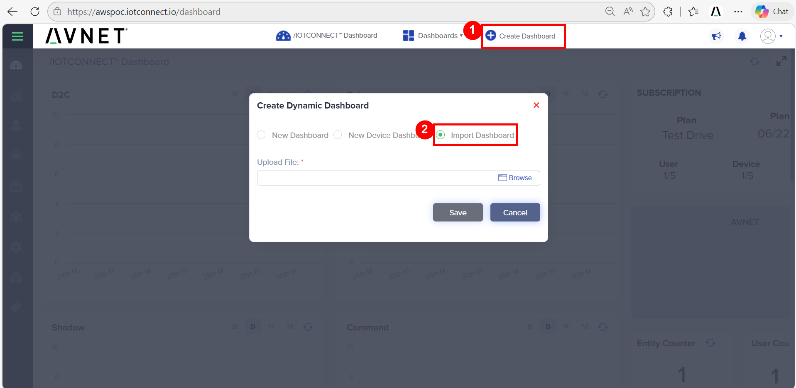

* Once the file uploads, additional fields appear. Fill them in:

  1. **Template** = `AvnetSTaws`
  2. **Device** = your unique device
  3. **Dashboard Name** = e.g. `ST AIoT Craft -ml4- SensorTile.Box Pro`
  4. Leave **Only Visible to Me** checked if you don't want to share within your account
  5. Pick a **Background Color** (e.g. `EEEEEE`)
  6. Click **Save**

  

* The dashboard opens in **Edit Mode** with the imported widgets and a widget palette. Drop in additional widgets if you like, or click **Save** in the top-right (highlighted below) to exit edit mode.

  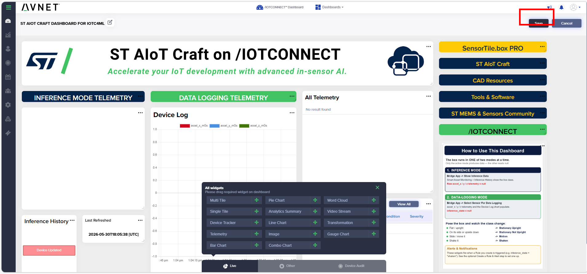

* Find your dashboard later under **Dashboards** in the top middle of the page.

The finished view groups the widgets into **Inference Mode Telemetry** (Smart Asset Monitoring, Inference History) and **Data Logging Telemetry** (Device Log, All Telemetry), alongside Alerts and Notifications — all bound to the device you just paired.

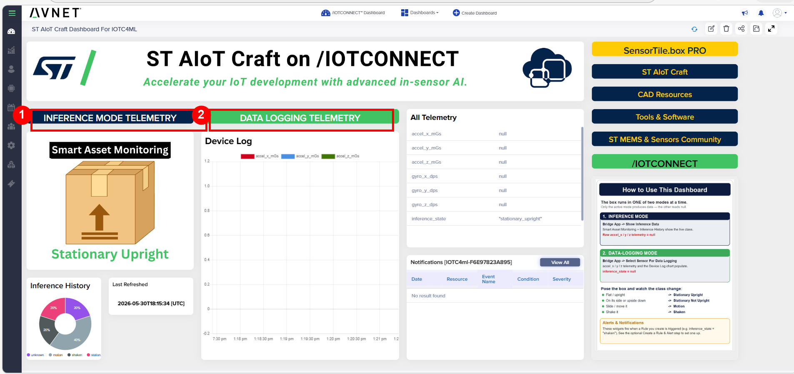

> **NOTE — only one section produces data at a time**
> **①** **Inference Mode Telemetry** populates only when **Run Inference** is selected in the Bridge App.
> **②** **Data Logging Telemetry** populates only when **Data Logging** is selected.

> **TIP**
> The dashboard supports five management actions from the top bar: **Refresh Data**, **Edit Mode**, **Delete**, **Share Link** (no login required), and **Export to JSON** (handy when onboarding another device).

> **NOTE — Built-in quick-reference panel**
> The imported dashboard already includes a quick-reference panel on the right (shown below) explaining the two telemetry modes — it's part of the template, so there's nothing to add yourself.
>
> 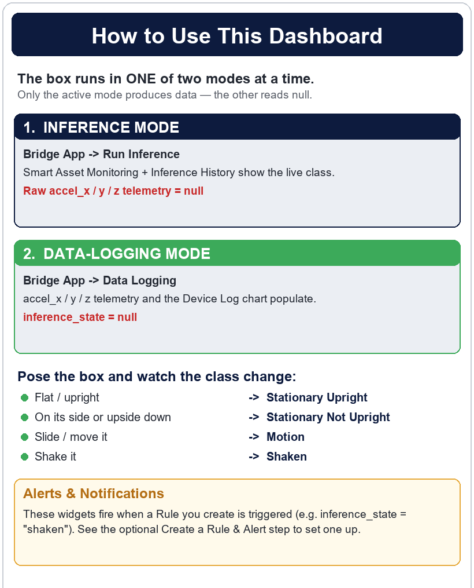

**Widgets in this dashboard**

The imported template mixes several widget types — each is a configurable building block you can re-style, reposition, or replicate:

- **Image** — static or classification-driven images (the AIoT Craft title banner).
- **Label** — colored section headers (`INFERENCE MODE TELEMETRY`, `DATA LOGGING TELEMETRY`).
- **HyperLink** — button-style external links (SensorTile.box PRO, ST AIoT Craft, CAD Resources, Tools & Software, ST MEMS Community, /IOTCONNECT).
- **Telemetry** — live key/value table for the device's attributes (All Telemetry).
- **LiveLineChart** — time-series chart of one or more numeric attributes (Device Log — `accel_x / y / z`).
- **Transformation** — display tied to a calculation or classification (Smart Asset Monitoring — image varies with `inference_state`).
- **pie** — pie chart aggregating recent values (Inference History).
- **Notifications** — recent rule-triggered alerts for the device (the Notifications panel — populates after you create a Rule in Step 15).
- **lastrefreshed** — timestamp of the dashboard's last data pull (Last Refreshed).

**Editing the Dashboard**

To customize a widget — change its title, swap colors, or add a new one — switch into **Edit Mode**.

1. From the live dashboard, click the **pencil (Edit Mode)** icon at the top-right (highlighted below).

   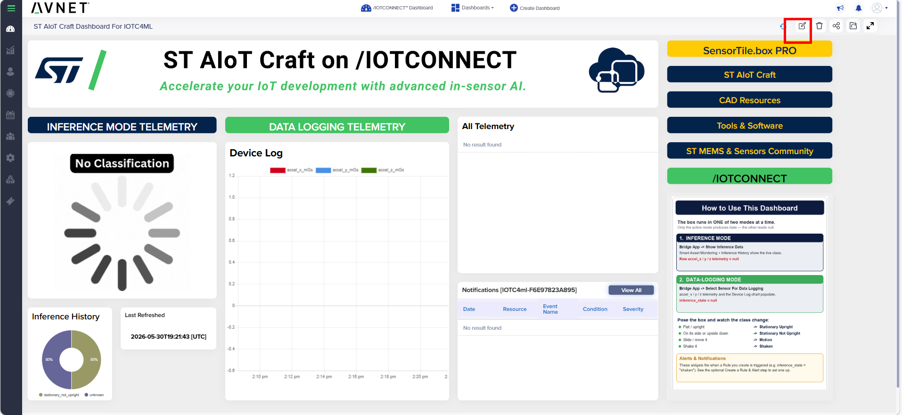

2. Edit Mode adds **Save** / **Cancel** at the top-right and opens the **All widgets** palette at the bottom — drag any widget from the palette onto the canvas to add a new one (highlighted below).

   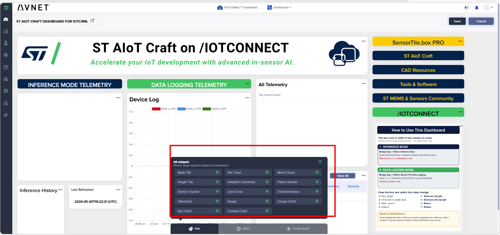

3. Click the **⋮ (three-dot)** menu in the widget's top-right corner (**①** below) and choose **Edit** (**②**) to open the **Widget Settings** panel. For simple widgets like **Label** that panel exposes **Background**, **Title Name**, and **Font Color / Style / Size** — adjust what you need and click **Apply** to save your changes.

   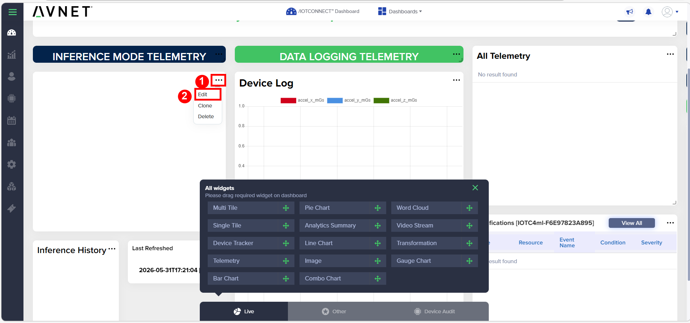

4. Data widgets (**Telemetry**, **LiveLineChart**, **Transformation**) also show a **WIDGETS CONTENT** panel on the right — pick the device and tick the sensor attributes the widget should display (highlighted below).

   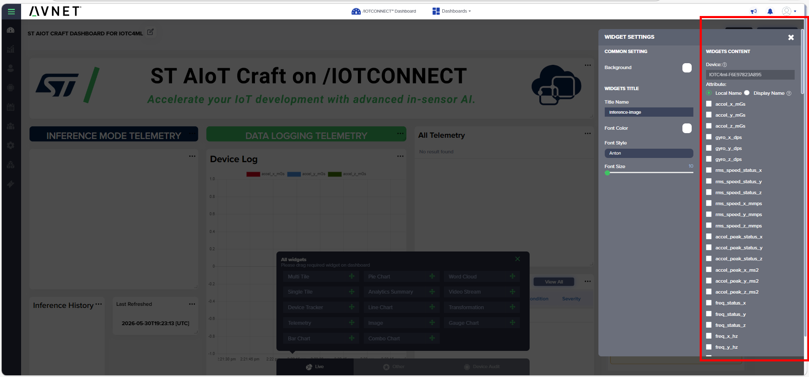

When you're done, click **Save** at the top-right to persist your changes (or **Cancel** to discard them).

## 13. Exercise the Live Inference

With the device in inference mode (Step 11) and the dashboard open (Step 12), close the loop end-to-end: pose the box and watch the classifications flow into the dashboard.

**Pose the box and watch the classifications**

Keep the dashboard visible while you put the box through each class the *Smart Asset Tracking* model recognizes. Hold each pose for several seconds so the class clearly registers in the **Smart Asset Monitoring** widget and in any class-history widget on the dashboard.

| | | | |
|---|---|---|---|
| Set the box flat | Tip it on its side | Move it around | Shake it briefly |
| → **Stationary Upright** | → **Stationary Not Upright** | → **Motion** | → **Shaken** |

The widget should change classes within a second or two of each pose. If a class never lights up, re-check the device is still in **Run Inference** mode in the Bridge App and that the AI Model List still shows **Connected to /IOTCONNECT** at the top.

**Confirm the data reached the cloud**

Drill into the device's live telemetry to see the inference classifications arriving from the Bridge App:

1. From the side menu, open **Devices → Device** (highlighted below).

   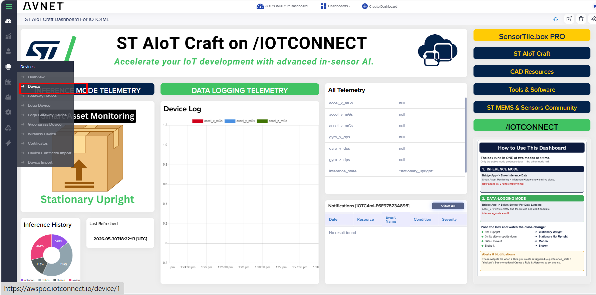

2. Click the device's **Unique ID** to open the Device Info page.

   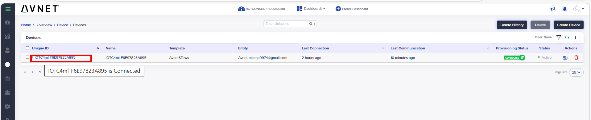

3. On the Device Info page, click **Live Data** in the left sidebar (highlighted below). You'll see JSON payloads arriving from the Bridge App with the MLC **class** fields populated. Remember from the note in Step 11: the raw accelerometer / gyroscope fields are **null** here — that's expected in inference mode, since the box only produces sensor data in data-logging mode.

   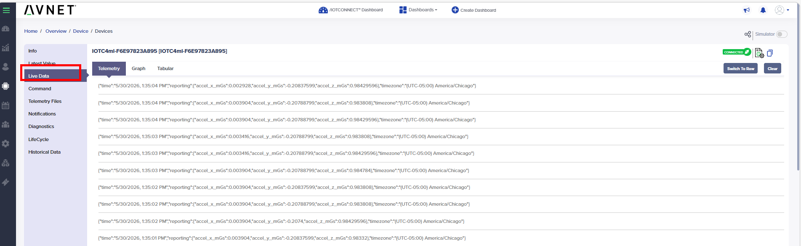

If Live Data is empty but the Bridge App's inference screen is still showing classes, give it a few seconds — the cloud side updates a beat behind the BLE link.

> **CHECKPOINT**
> Before moving on, confirm three things are true at the same time:
> 1. The Bridge App is in **Run Inference** mode and class labels are changing as you pose the box.
> 2. The dashboard's **Smart Asset Monitoring** widget is tracking those class changes within a second or two.
> 3. **Device Info → Live Data** shows fresh JSON payloads with the MLC **class** fields populated (the raw sensor fields being null is expected in this mode).
>
> If all three are true, the inference half of the device → BLE → Bridge App → /IOTCONNECT → dashboard chain is healthy.

## 14. View Live Sensor Data (Data Logging Mode)

In this step we'll instruct the SensorTile.box PRO to switch to **data-logging mode** so we can see the raw sensor data arrive in the cloud dashboard. The **Data Logging Telemetry** widgets will start populating and the inference widgets will stop — only one mode produces data at a time (see the two-modes note in Step 11).

1. **Switch to data-logging mode.** In the Bridge App, return to the **AI Model List** (back arrow), keep **Smart Asset Tracking** selected, and tap **Data Logging** at the bottom.

   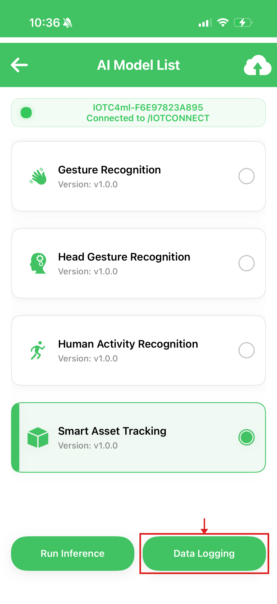

2. **Pick the sensor.** On the Select Sensor screen, tap **Accelerometer**, then **Start**.

   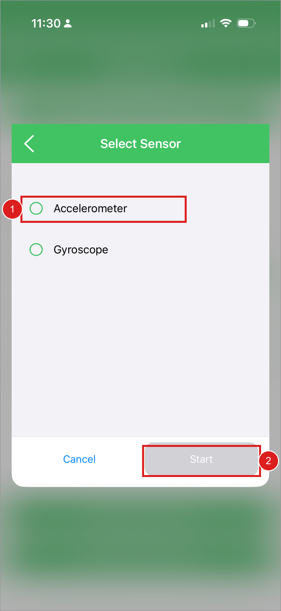

3. **Watch the cloud dashboard.** Switch to your browser. Move the box around — the **Device Log** widget starts plotting the live accel traces, **All Telemetry** shows real `accel_x_mGs / accel_y_mGs / accel_z_mGs` values updating each second, and `inference_state` reads **null**.

   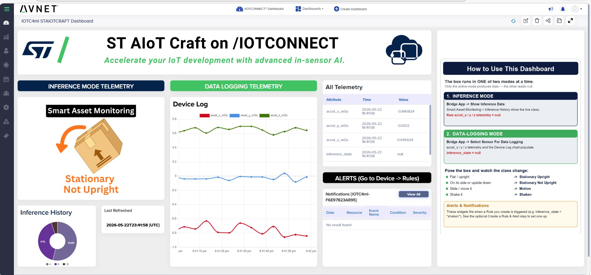

4. **Stop when you're done.** In the Bridge App, tap **Stop** to end the session and return to the AI Model List.

You've now driven the dashboard from both modes. The full labeled-capture flow (recording tagged sensor segments so AIoT Craft can train on them) is what **[Lab 2](./st_aiotcraft_lab2_train.md)** is all about.

## 15. (Optional) Create a Rule & Alert

The dashboard's **Alerts** and **Notifications** widgets stay empty until a **Rule** fires. A Rule watches an attribute (like `inference_state`) and raises an alert when a condition is met — for example, notify you whenever the box reports **shaken**. This step is optional, but it shows how an inference result can drive automation.

1. **Open Rules.** From the device area, click **Rules** in the toolbar along the bottom of the page.

   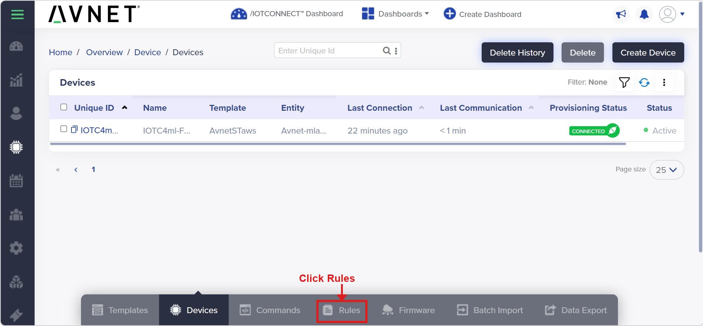

2. **Start a new rule.** The Rules page is empty to begin with — click **Create Rule** at the top right.

   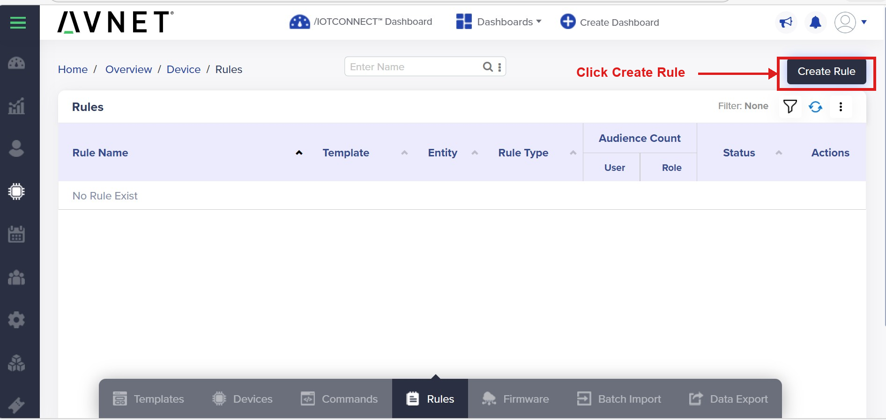

3. **Define the rule** (numbered overlays below):
   1. **Rule name** — e.g. `Product damaged`.
   2. **Template** — `AvnetSTaws`.
   3. **Severity levels** — e.g. `Critical`.
   4. **Rule type** — choose **Smart Rule**.
   5. **Conditions** — enter a condition on an attribute, e.g. `inference_state = "shaken"`. Use the **Select Attributes** list on the right to insert `inference_state`, then click **Verify**.

   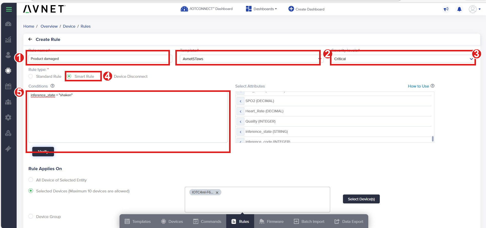

   Under **Rule Applies On**, choose **Selected Devices** and pick your device.

4. **Choose how you're notified, then save** (numbered overlays below):
   1. Under **Notification Type**, open the **UI Alert** tab and toggle **Enable** on.
   2. Under **Audience → Users**, select yourself so the alert reaches you.
   3. Click **Save**.

   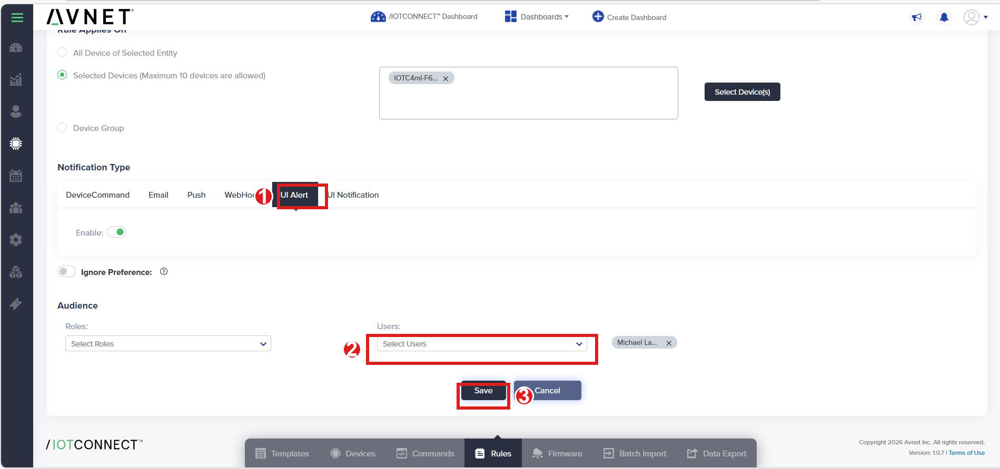

Now switch the box back to inference mode (**Run Inference**) and **shake it**. When `inference_state` hits `shaken`, the rule fires and the alert appears in the **Notifications** widget on your dashboard (and under the bell icon in the top bar).

## Lab 1 Recap

| Stage | Time | What you did | Section |
|---|---|---|---|
| **1. Connect** | ~10 min | Account · STAIOT association · BLE pair · template/device verified | Steps 1–9 |
| **2. Deploy a model** | ~10 min | OTA push a starter model · live inference on device | Steps 10–11 |
| **3. Visualize & verify** | ~15 min | Import dashboard · exercise both modes (inference + data logging) · confirm cloud telemetry end-to-end | Steps 12–14 |

Leave the device paired, the Bridge App open on **AI Model List**, your browser logged into /IOTCONNECT, and your dashboard up — **[Lab 2](./st_aiotcraft_lab2_train.md)** starts here.

## Next

**[Lab 2 — Train Your Own MLC Model with ST AIoT Craft](./st_aiotcraft_lab2_train.md)** — capture labeled sensor data, train a custom MLC model in the cloud, and push it back to the device. The dashboard you just built will be your live view of the new model once it's deployed.

## See Also

* [Engineering Note — Hardware Revisions, DATALOG2 Firmware & BlueST SDK Compatibility](./st_aiotcraft_engineering_note.md) — why the labs standardize on v3.1.0, failure signatures, and AWS/Azure environment notes
* [Main Mobile App Guide](./mobile_app_guide.md) — the production AWS flow with `BLESensorsPnPL.bin` / `STSW-MKBOXPRO_1_1_1.bin` firmwares
* [SensorTile.box PRO Getting Started Guide](https://www.st.com/resource/en/user_manual/um3133-getting-started-with-sensortilebox-pro-multisensors-and-wireless-connectivity-development-kit-for-any-intelligent-iot-node-stmicroelectronics.pdf) — DFU mode, hardware reference
* [/IOTCONNECT Product Updates](https://docs.iotconnect.io/iotconnect/platform/product-updates/) — AIoT Craft GA timeline
