# Lab 1 — Deploy a Starter MLC Model   /IOTCONNECT Bridge App + ST SensorTile.box PRO + ST AIoT Craft

This is the first of two labs. **Lab 1 takes you from zero to a pre-built AI model running on the SensorTile.box PRO**, with live inference streaming to the Bridge App on your phone, a /IOTCONNECT dashboard visualizing both the inference results and the raw sensor telemetry. **[Lab 2](./st_aiotcraft_lab2_train.md)** picks up from there: capture your own labeled data, train a custom MLC model with ST AIoT Craft, and OTA it back to the device.

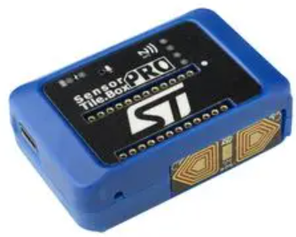

> **NOTE**
> This guide tracks the **AWS POC** instance of /IOTCONNECT (the environment used for the ST AIoT Craft preview). Production release is planned for June; release notes are tracked at <https://docs.iotconnect.io/iotconnect/platform/product-updates/>. Where the [main mobile app guide](./mobile_app_guide.md) covers the production AWS environment, **use the URLs in this guide** for the AIoT Craft flow.

## Prerequisites

In addition to the ST SensorTile.box PRO, you will need:

- A **/IOTCONNECT POC** account — you will create this in Step 1
- An Android or iOS device (acts as the BLE-to-WAN bridge)
- A SensorTile.box PRO running **FP-SNS-DATALOG2_Datalog2 v3.1.0** firmware (this is the version AIoT Craft expects; the kits handed out for the lab ship pre-flashed)
- The 7-character identifier printed on the back of your SensorTile.box PRO — you will use it to pick the right device out of the BLE list
- Desire to learn!

> **NOTE**
> If you need to (re)flash the SensorTile.box PRO yourself, refer to Chapter 2.2 of the [SensorTile.box PRO Getting Started Guide](https://www.st.com/resource/en/user_manual/um3133-getting-started-with-sensortilebox-pro-multisensors-and-wireless-connectivity-development-kit-for-any-intelligent-iot-node-stmicroelectronics.pdf) for DFU instructions and the [STM32CubeProgrammer](https://www.st.com/en/development-tools/stm32cubeprog.html). The flow in this guide assumes the datalog2 firmware is already on the box.

## 1. Subscribe to /IOTCONNECT

Open the /IOTCONNECT POC subscription page:
[http://avnet.me/IOTC-4-ST](http://avnet.me/IOTC-4-ST) (resolves to <https://pocsubscription.iotconnect.io/registration>).

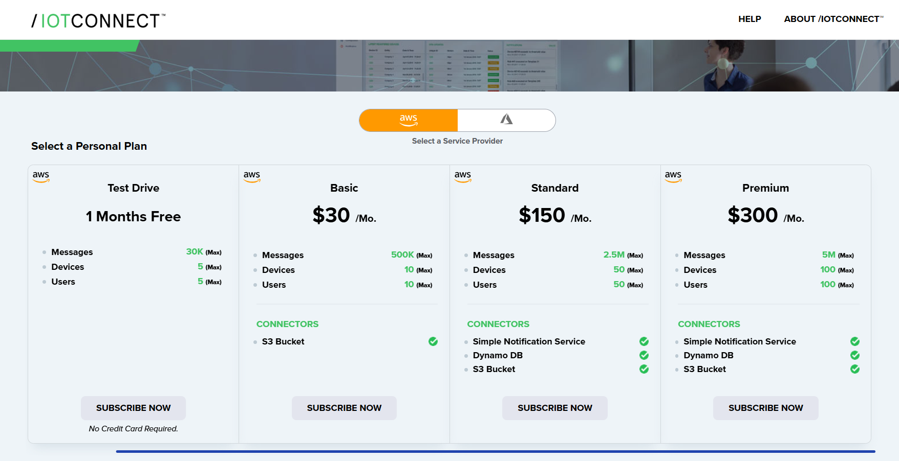

* Pick the **Trial** plan (1 month free, no credit card required) and click **Subscribe Now**.

Complete the registration form:

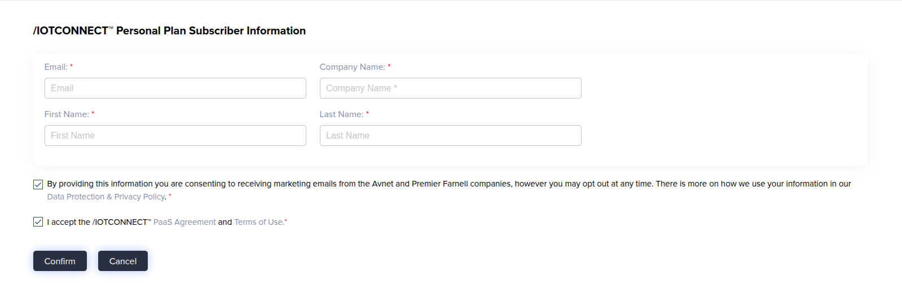

> **IMPORTANT**
> The email you submit here becomes the **account owner** with full admin permissions, and the company name you enter becomes your account's unique identifier. For the lab, use your real company name **plus something unique** (e.g., your initials).  Note, this form will reject email addresses and company names that have been previously registered.

## 2. Receive Account Information Emails

After submitting registration, expect two emails from /IOTCONNECT:

| | |
|---|---|
| 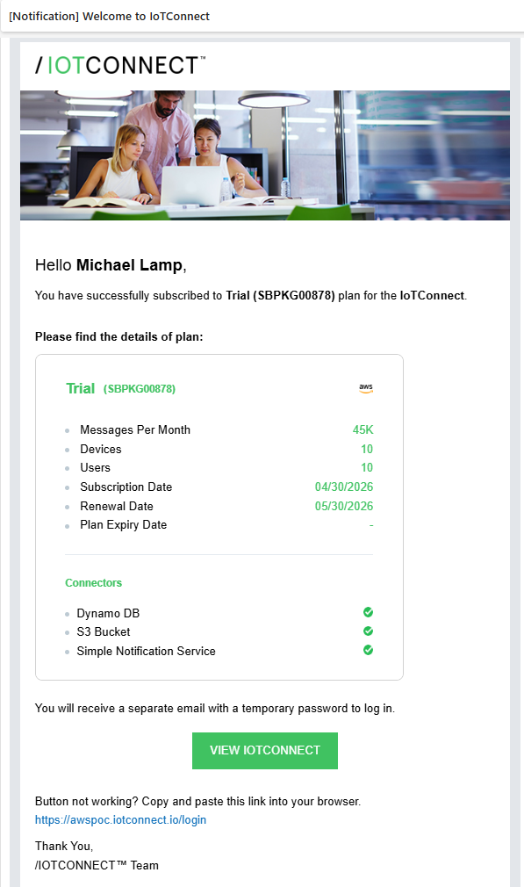 | 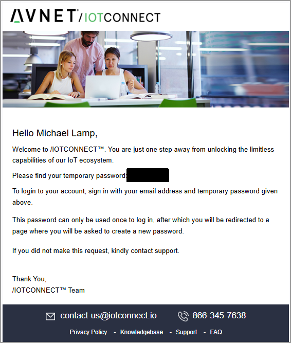 |
| **Welcome to /IOTCONNECT** — plan info and the green **VIEW /IOTCONNECT** button that takes you to the login page. | **Temporary password** — single-use, you'll be forced to reset it on first login. |

> **NOTE**
> Check your SPAM folder if the emails don't arrive within a couple of minutes.

## 3. Log in to /IOTCONNECT

Open the login page in a browser:
<https://awspoc.iotconnect.io/login>

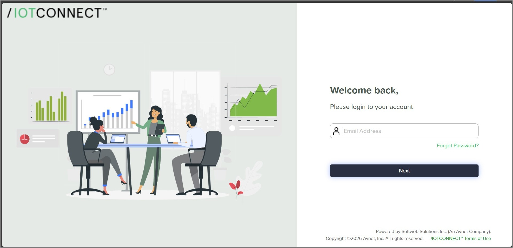

* Enter your email and the temporary password from the second email.
* You will be redirected to a **Reset Password** page — set a new password and submit.
* Log in again with your new password.

After authentication you land on the **Company Account Dashboard**.

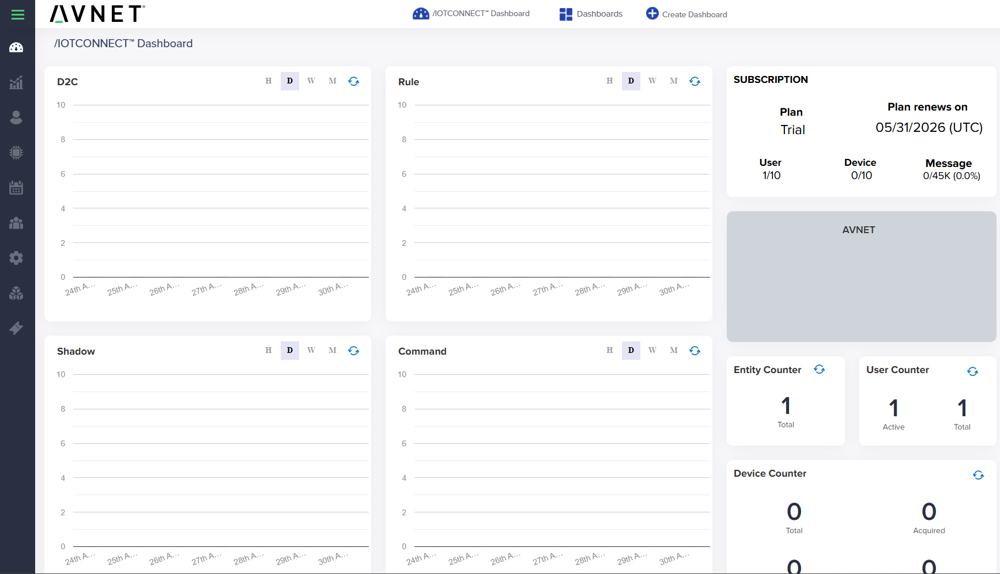

## 4. Connect /IOTCONNECT to ST AIoT Craft

This step links your /IOTCONNECT tenant to the ST AIoT Craft cloud so trained models can flow back from AIoT Craft into your AI Module Library. You will not see the payoff of this association until **Lab 2**, but it has to be in place before you start uploading training data.

1. Open the side menu and navigate to **Settings → Configurations**.

2. In the **Configurations** panel, under **General**, click **STAIOT** (marked **①** below). It's the fourth row under *General* — easy to miss against the panel's subtle highlight, and it sits behind the **Settings** flyout menu until you close that menu by clicking inside the Configurations panel.

   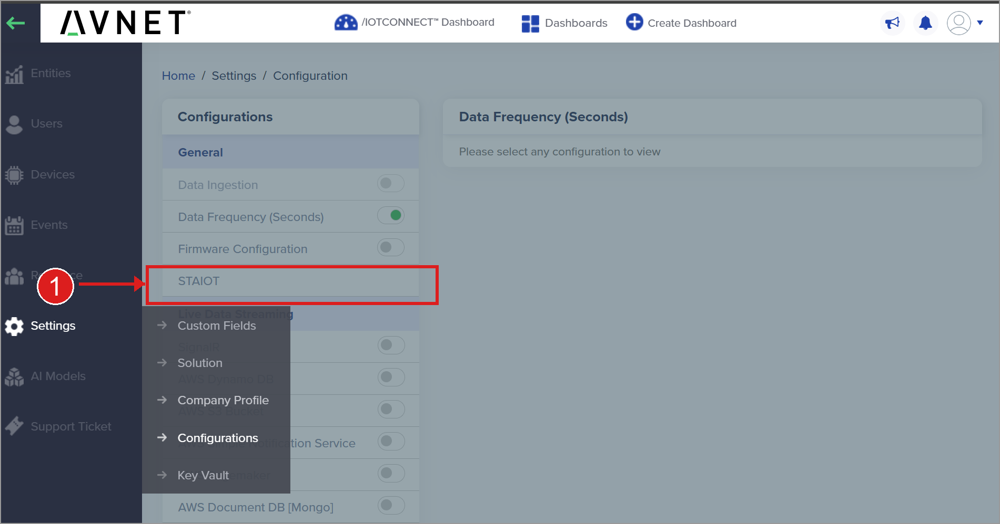

3. On the right-hand panel, click the **+ Create Association** button (marked **②**).

   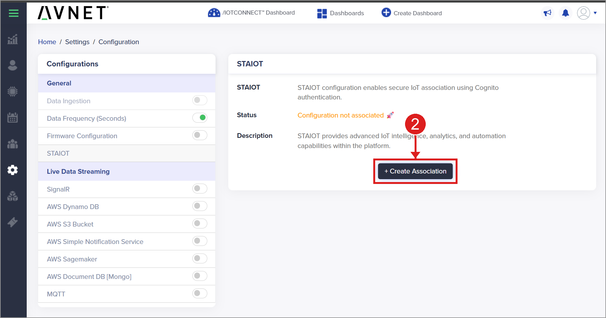

4. A Cognito sign-in dialog opens. Choose **avnet-iotc-stage**.

   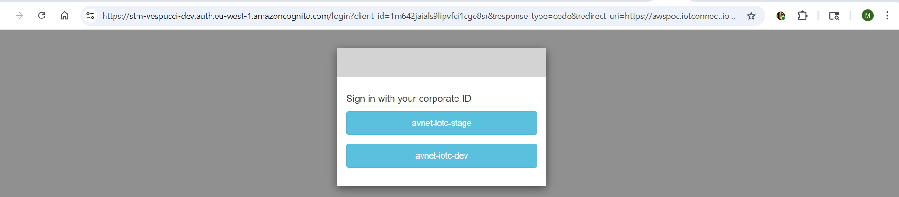

## 5. Download the /IOTCONNECT Bridge App (Beta)

Use the QR codes below to install the Bridge App. (This is the beta build distributed via Updraft; the app-store release lands in June.)

### iOS App
URL: <http://avnet.me/iotc-ios-bridge>

### Android App
URL: <http://avnet.me/iotc-android-bridge>

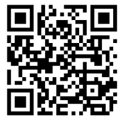

> **iOS only — "Untrusted Enterprise Developer"**
> Because the beta is distributed outside the App Store, iOS 26 will block it on first launch with the message **"Untrusted Enterprise Developer."** To trust it:
> 1. Open **Settings → General → VPN & Device Management** (may appear as **Profiles & Device Management**).
> 2. Under **Enterprise App**, tap the developer **Softweb Solutions Inc.** and tap **Trust**, then confirm.
> 3. iOS may ask you to **Allow & Restart** — let it. After reboot, complete any **"Ready to Install Profile"** prompt and tap **Done**.
> 4. Launch the Bridge App from your Home Screen.

> **Android only — "Install unknown apps" / Play Protect**
> Because the beta is distributed via Updraft (not the Play Store), Android will prompt you a couple of times before letting it install. Open the Updraft URL in **Chrome** on your phone and:
> 1. Tap **Install** on the Updraft page. Chrome will say **"For your security, your phone isn't allowed to install unknown apps from this source."** Tap **Settings**.
> 2. Toggle **Allow from this source** on for Chrome (or the browser you used). Back out — the install prompt resumes automatically.
> 3. Tap **Install** on the package installer screen.
> 4. If **Play Protect** warns *"Block harmful app?"* or *"App not approved by Play Protect,"* tap **More details → Install anyway**. The app is unsigned for the Play Store, not malicious.
> 5. When install completes, tap **Open** to launch the Bridge App from the installer, or find the icon in your app drawer.

## 6. Log in to the Bridge App

Open the **/IOTCONNECT Bridge** app and sign in.

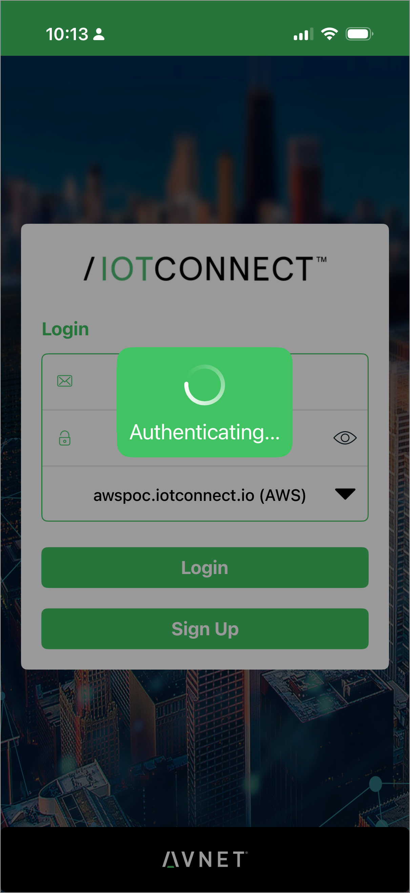

* Use the **same credentials** you used in the browser.
* Set the environment to **`awspoc.iotconnect.io (AWS)`**.
* Tap **Login**.

## 7. Pair the SensorTile.box PRO

With the box powered on, the Bridge App scans for BLE devices automatically.

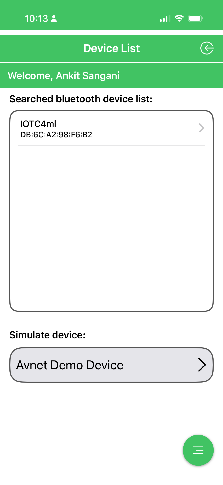

* Locate the device whose name ends with the **7-character identifier printed on your box** (the screenshot shows a generic `IOTC4ml` example — yours will differ).
* If the list stays empty after a few seconds, tap the green menu button in the lower-right corner and choose **Scan Device**.
* Tap your device to pair.

Selecting your device will automatically:
1. Create a device template in /IOTCONNECT (if one does not already exist for this firmware).
2. Register a new device in /IOTCONNECT keyed to your box's identifier.
3. Show the **/IOTCONNECT Details** sheet confirming the connection.

   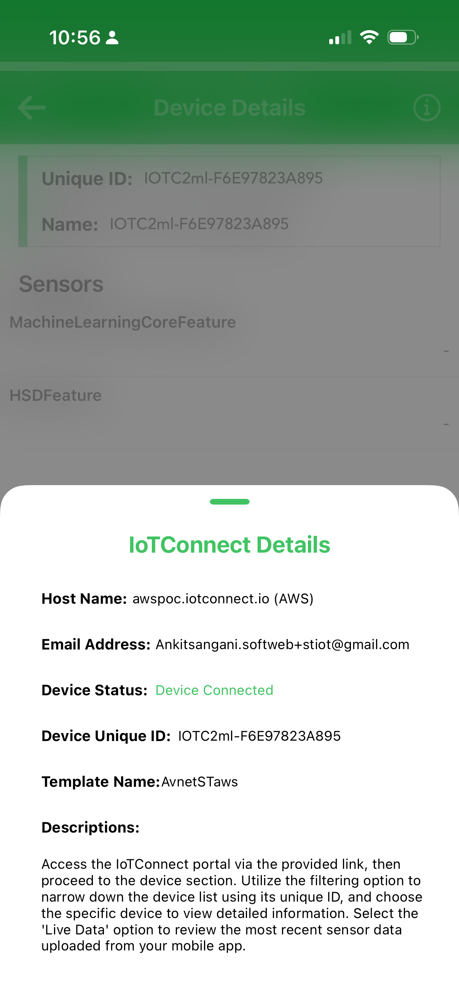

## 8. Verify the Device in /IOTCONNECT

Switch back to the browser and confirm the device showed up.

* From the left menu open **Devices → Device**.

  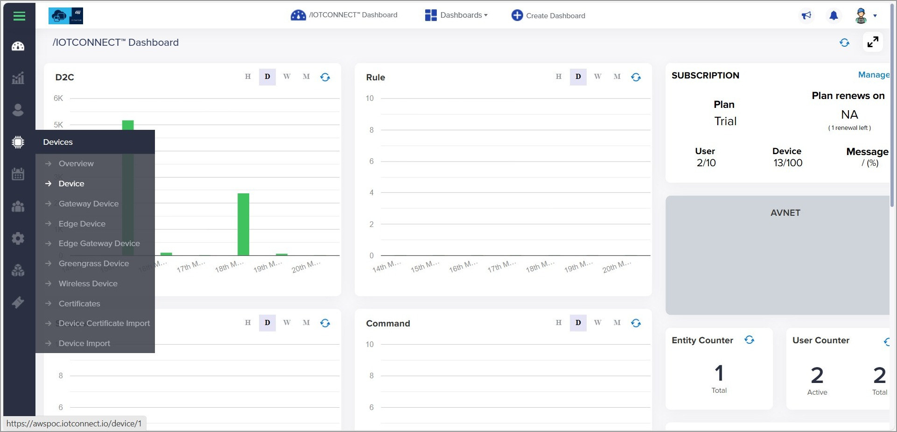

* Sort by **Last Connection** (click the column header twice for descending) to bring your newly paired device to the top — its Provisioning Status should be **CONNECTED**.

  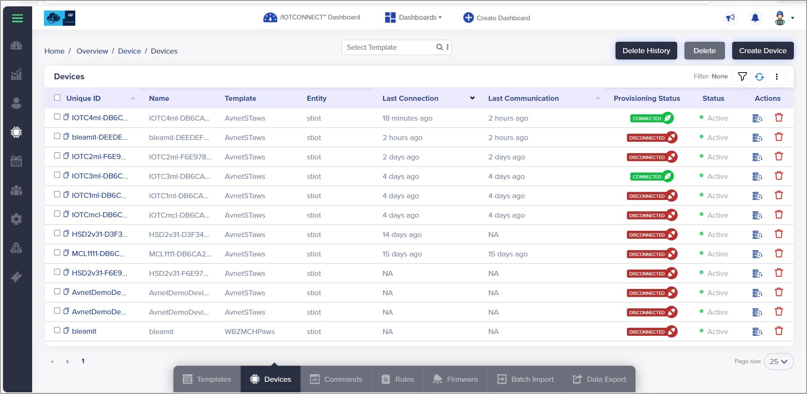

* Click the **Unique ID** of your device to open the Device Info page.

  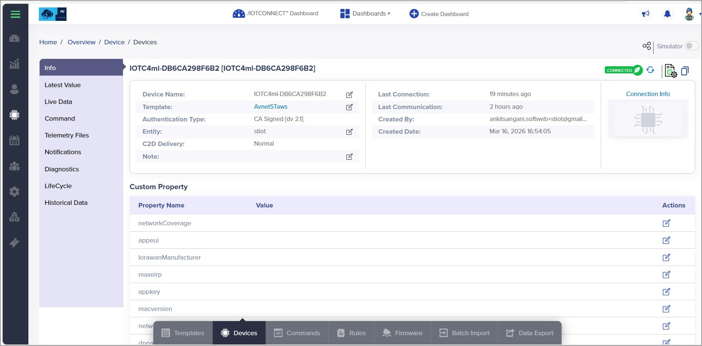

## 9. Verify the Template

The Bridge App also auto-creates the **AvnetSTaws** template if it isn't already there. From **Templates** you can confirm the template exists, has File Upload enabled (so the Bridge App can ship logging sessions to /IOTCONNECT), and exposes the SensorTile attribute set.

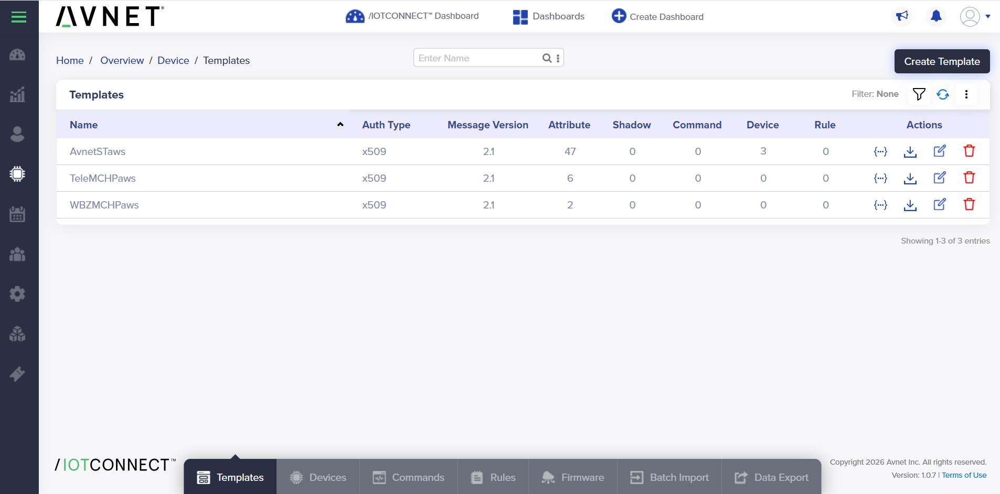

* Click into **AvnetSTaws** to see its **Properties** (note **Enable File Support** is on)…

  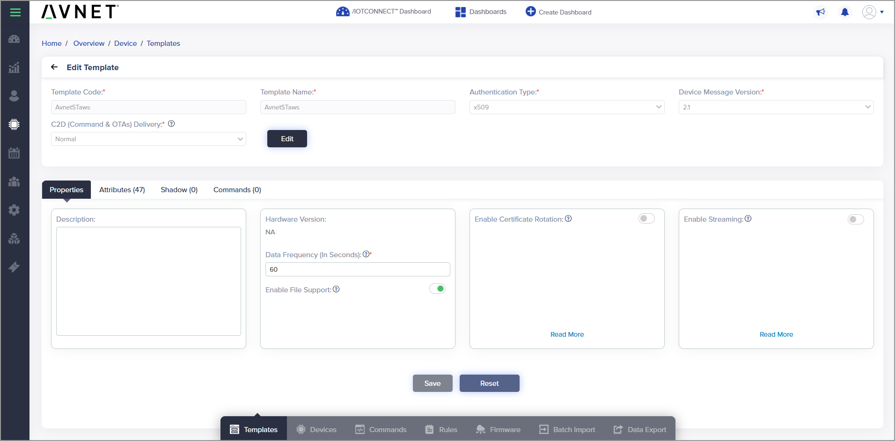

* …and its **Attributes** (47 sensor attributes — accel, gyro, RMS speed, MLC features, etc.).

  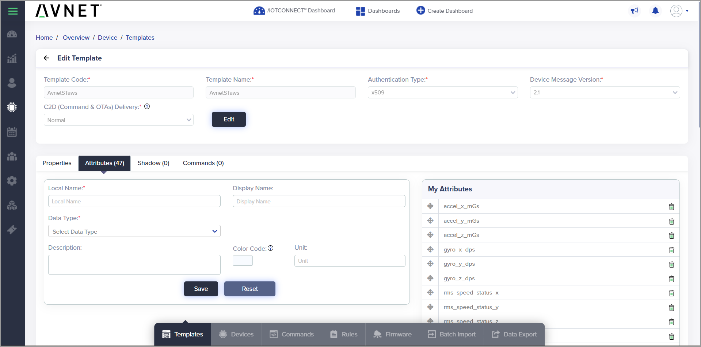

## 10. Push the Smart Asset Tracking Model

/IOTCONNECT ships with four ready-to-run starter modules under **Modules → Module**. These are the same model format AIoT Craft produces, so once you've walked the loop with one of them you've already seen the deployment story end-to-end. **For this lab, push the Smart Asset Tracking module** — it's the one Step 11 and the dashboard in Step 12 are wired up for.

| Starter module | What it detects |
|---|---|
| **Gesture Recognition** | Hand & wrist motion patterns |
| **Head Gesture Recognition** | Nod, shake, tilt — wearables |
| **Human Activity Recognition** | Walking, running, stationary, fall |
| **Smart Asset Tracking** ← use this one | Stationary upright / not upright, motion, shaken |

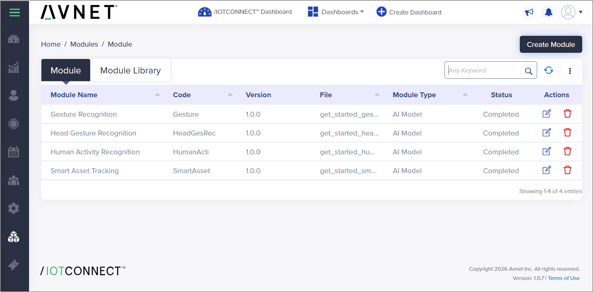

> **NOTE**
> The **Module Library** tab lets you create or upload custom modules. The **Module** tab is the per-account, deployable list — the entries here can be pushed to devices.
>
> 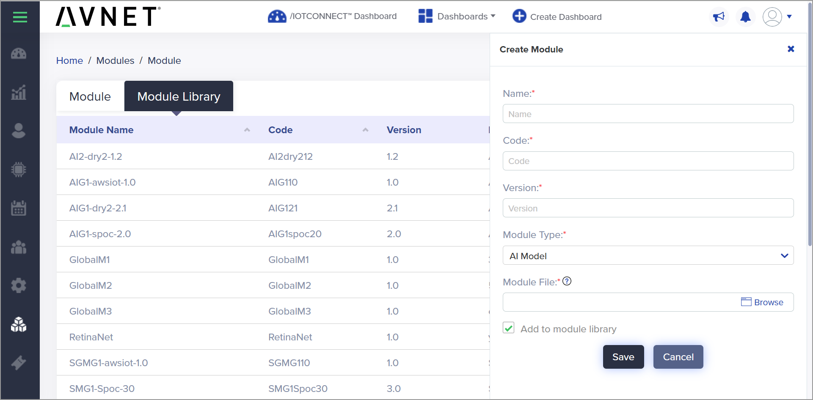

To deploy **Smart Asset Tracking** to your box:

1. Open **Modules → Push Modules**.
2. Fill in the **Push Module** form (numbered overlays in the screenshot below):

   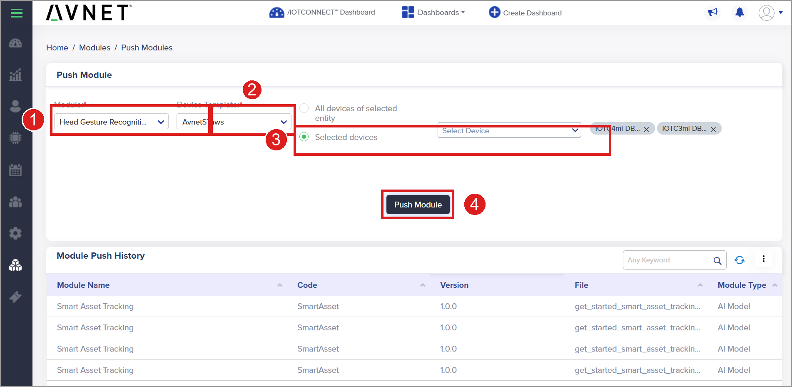

   1. **Module** — pick **Smart Asset Tracking**. *(The example screenshot above shows a different option pre-selected — make sure you switch it.)*
   2. **Device Template** — pick **AvnetSTaws**.
   3. **Selected devices** — toggle this radio (not *All devices of selected entity*) and pick your device from the **Select Device** dropdown.
   4. Click the **Push Module** button.

The Bridge App receives the OTA over BLE and writes the module to the SensorTile.box PRO's Machine Learning Core.

> **TIP — Try the other modules later**
> Once you've finished Lab 1 with **Smart Asset Tracking**, come back to this step and push one of the other starter modules (*Gesture Recognition*, *Head Gesture Recognition*, *Human Activity Recognition*) to see a different set of classifications stream into the same Bridge App and dashboard. Each module targets the same `AvnetSTaws` template, so no rewiring needed — just **Push Module** again and tap the new card in the AI Model List.

## 11. View Live Inference on the Phone

After pairing, the Bridge App lands on the **AI Model List** screen with the modules available for your device. If your model has been pushed to the device, the model card will be filled dark green — in the screenshot below, **Smart Asset Tracking** is the active card. If yours isn't filled green, redeploy the model from Step 10.

Tap **Show Inference Data** at the bottom (highlighted in red below). The app pushes the device into inference mode and starts streaming MLC results.

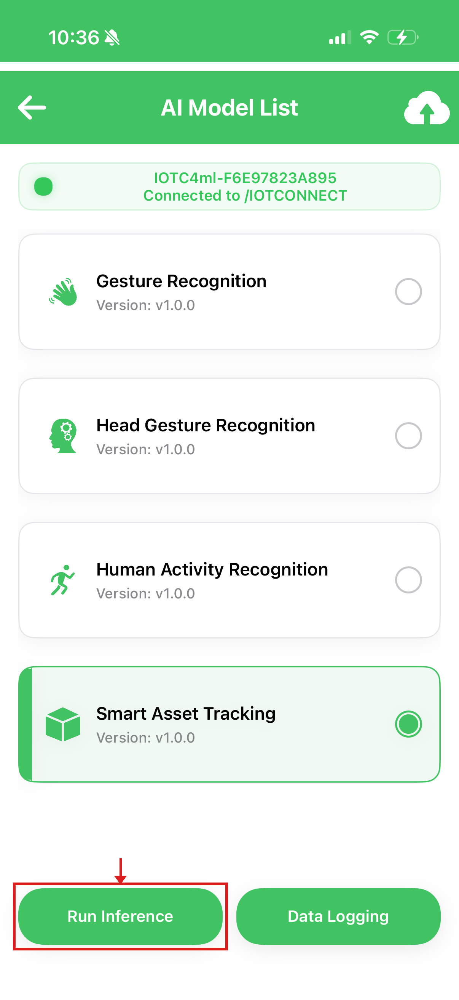

The app then downloads the model bundle (if not already cached) and applies the configuration to the box:

| | |
|---|---|
| 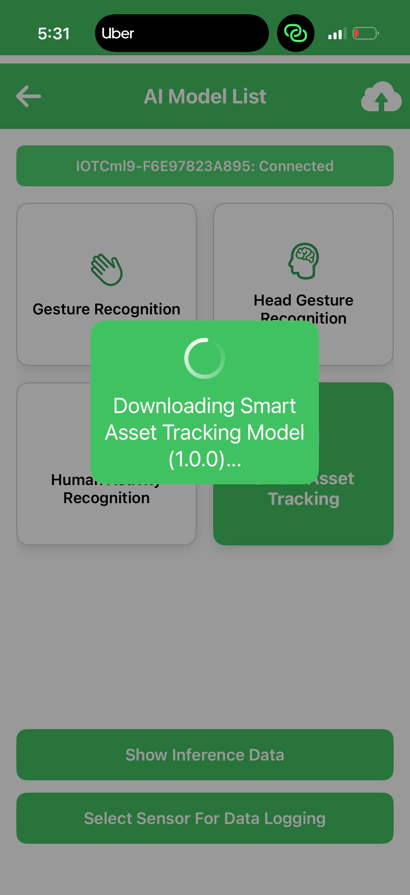 | 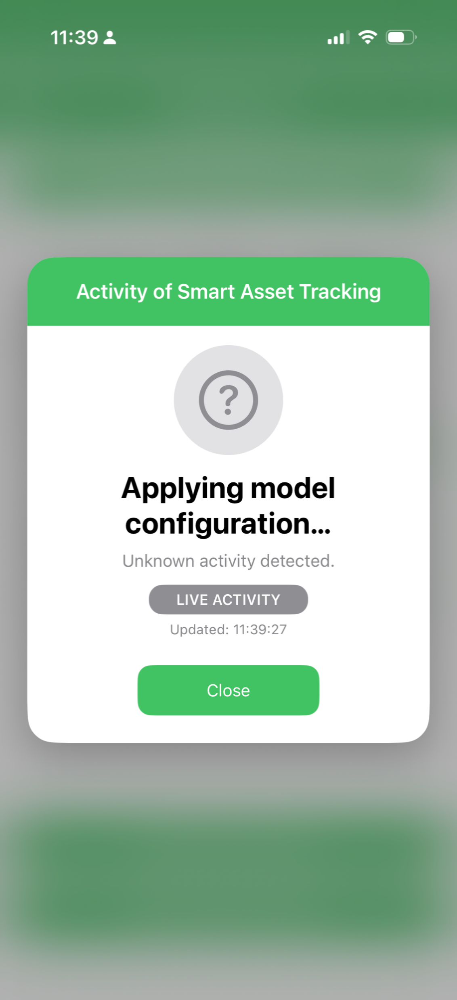 |
| Downloading | Applying Config |

For *Smart Asset Tracking*, the four classes light up in real time as you pose the box:

| | | | |
|---|---|-----|---|
| 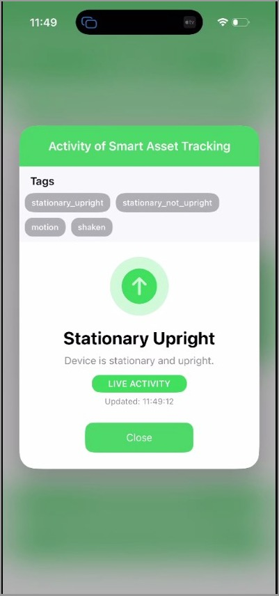 | 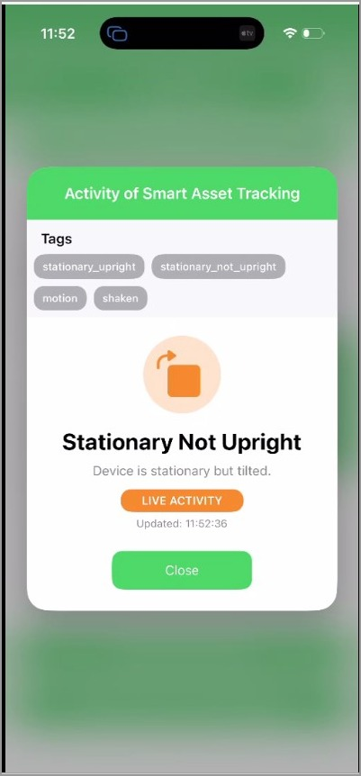 | 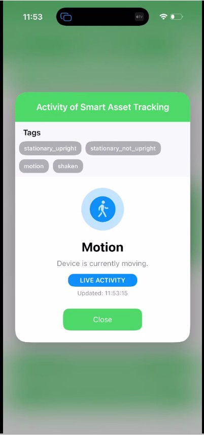 | 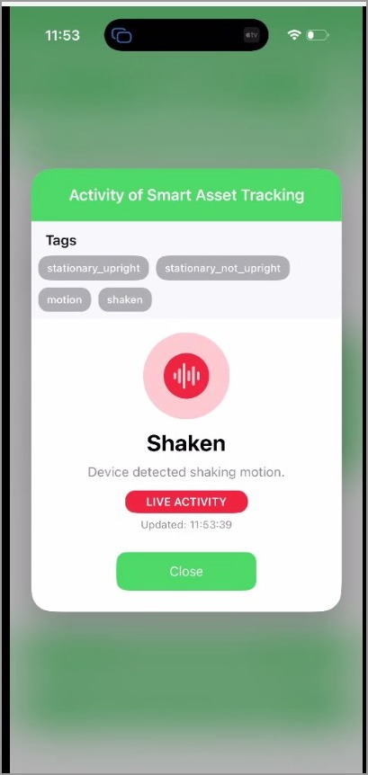 |
| Stationary Upright | Stationary Not Upright | Motion | Shaken |

Inference results — together with raw sensor telemetry — are streamed to /IOTCONNECT, ready for the dashboard you'll build next.

## 12. Create a Dashboard

Dynamic Dashboards visualize live telemetry, inference history, and any other attribute attached to your device template. The inference results and raw sensor values now flowing in from Step 11 are already in /IOTCONNECT — this step gives them a UI.

* Download the [ST AIoT Craft dashboard template](https://iotcimage.s3.us-east-1.amazonaws.com/dashboards/STMicro/aiotcraft/ST_AIoT_CraftDashboard.json) (right-click and **Save As…**).
* In /IOTCONNECT, click **Create Dashboard** at the top right and choose **Import Dashboard**.

  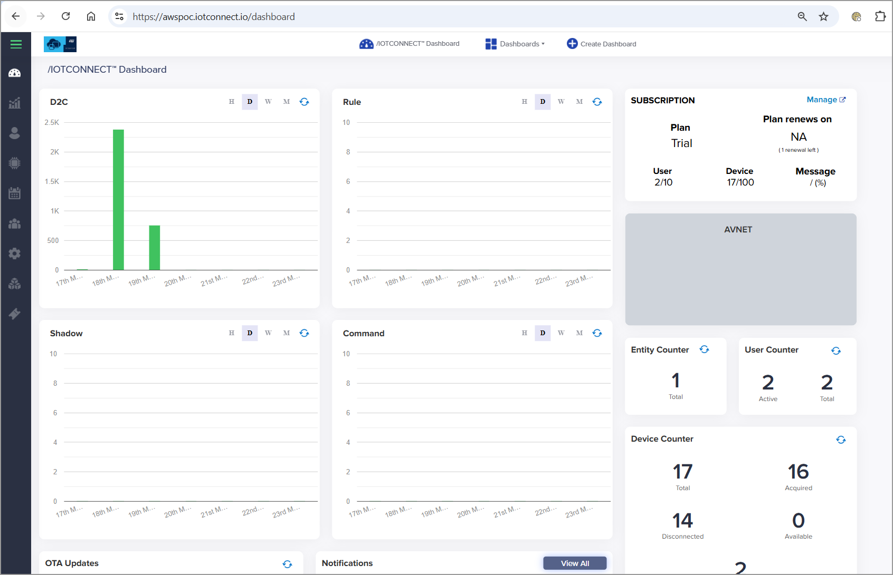

* In the dialog, browse to the saved `.json` file, then fill in:

  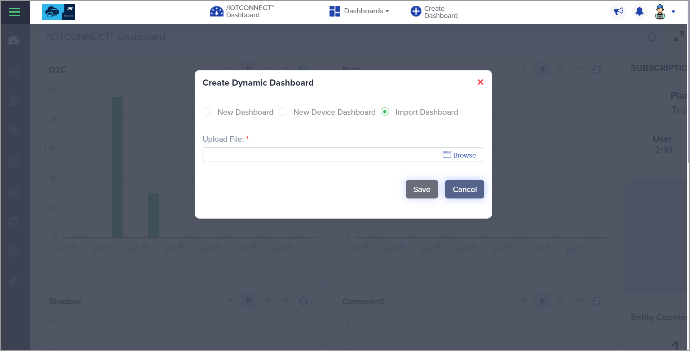

  1. **Template** = `AvnetSTaws`
  2. **Device** = your unique device
  3. **Dashboard Name** = e.g. `ST AIoT Craft -ml4- SensorTile.Box Pro`
  4. Leave **Only Visible to Me** checked if you don't want to share within your account
  5. Pick a **Background Color** (e.g. `EEEEEE`)
  6. Click **Save**

  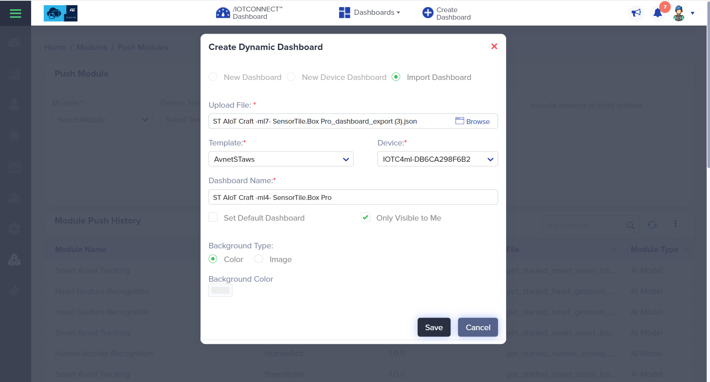

* The dashboard opens in **Edit Mode** with the imported widgets and a widget palette. Drop in additional widgets if you like, or click the blue **Save** in the top-right to exit edit mode.

  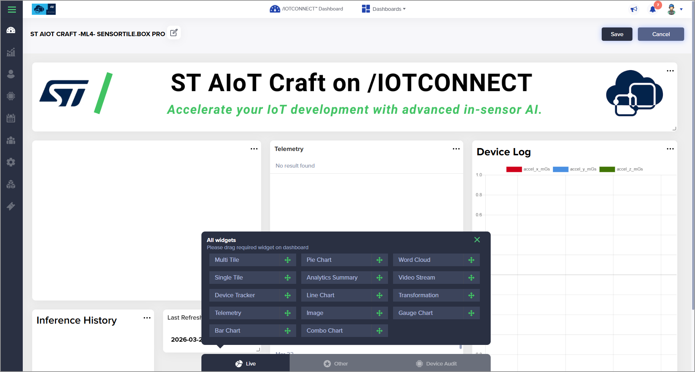

* Find your dashboard later under **Dashboards** in the top menu.

  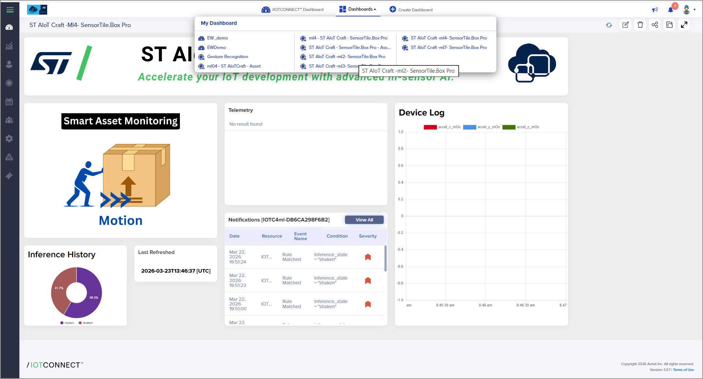

The finished view shows live inference (`Smart Asset Monitoring` widget), telemetry, device log, and notifications — all bound to the device you just paired.

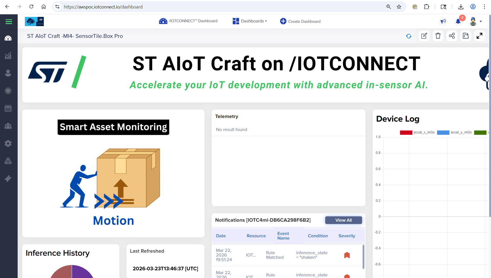

> **TIP**
> The dashboard supports five management actions from the top bar: **Refresh Data**, **Edit Mode**, **Delete**, **Share Link** (no login required), and **Export to JSON** (handy when onboarding another device).

## 13. Exercise the Inference and Sensor Telemetry

With the device in inference mode (Step 11) and the dashboard open (Step 12), close the loop end-to-end: pose the box, watch the classifications flow into the dashboard, and confirm raw sensor telemetry is streaming alongside.

**Pose the box and watch the classifications**

Keep the dashboard visible while you put the box through each class the *Smart Asset Tracking* model recognizes. Hold each pose for several seconds so the class clearly registers in the **Smart Asset Monitoring** widget and in any class-history widget on the dashboard.

| | | | |
|---|---|---|---|
| Set the box flat | Tip it on its side | Move it around | Shake it briefly |
| → **Stationary Upright** | → **Stationary Not Upright** | → **Motion** | → **Shaken** |

The widget should change classes within a second or two of each pose. If a class never lights up, re-check the device is still in **Show Inference Data** mode in the Bridge App and that the Bridge App still shows **CONNECTED** in the **/IOTCONNECT Details** sheet.

**Verify raw sensor telemetry is streaming**

The Bridge App streams more than just MLC classifications — the accelerometer, gyroscope, and derived features defined on the **AvnetSTaws** template (Step 9) flow up as telemetry too. Two ways to verify:

* On the **dashboard** you built in Step 12, watch the telemetry chart widgets — the accel / gyro traces should sweep in real time as you move the box.
* On the **device's Device Info page** (Step 8), click the **Live Data** tab. You'll see the JSON payload arriving from the Bridge App, including both the MLC class labels and the raw sensor fields.

  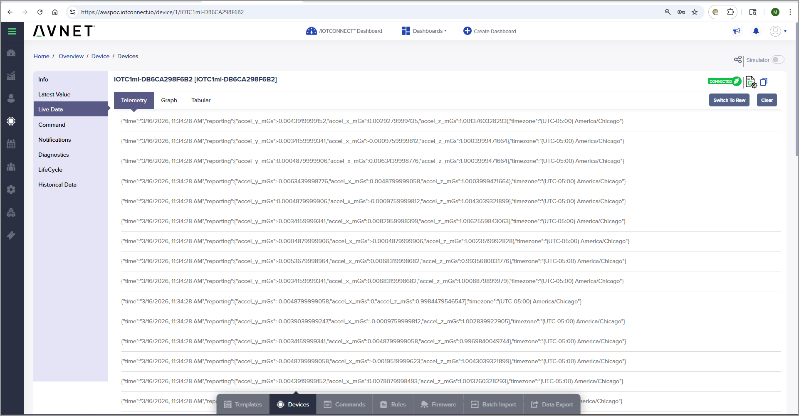

If Live Data is empty but the Bridge App's inference screen is still showing classes, give it a few seconds — the cloud side updates a beat behind the BLE link.

> **CHECKPOINT**
> Before moving on, confirm three things are true at the same time:
> 1. The Bridge App is in **Show Inference Data** mode and class labels are changing as you pose the box.
> 2. The dashboard's **Smart Asset Monitoring** widget is tracking those class changes within a second or two.
> 3. **Device Info → Live Data** shows fresh JSON payloads arriving with both MLC class fields and raw accel / gyro values.
>
> If all three are true, the full device → BLE → Bridge App → /IOTCONNECT → dashboard chain is healthy and you are ready for Lab 2.

## Lab 1 Recap

| Stage | Time | What you did | Section |
|---|---|---|---|
| **1. Connect** | ~10 min | Account · STAIOT association · BLE pair · template/device verified | Steps 1–9 |
| **2. Deploy a model** | ~10 min | OTA push a starter module · live inference on device | Steps 10–11 |
| **3. Visualize & verify** | ~10 min | Import dashboard · pose the box · confirm classifications + raw telemetry end-to-end | Steps 12–13 |

Leave the device paired, the Bridge App open on **AI Model List**, your browser logged into /IOTCONNECT, and your dashboard up — **[Lab 2](./st_aiotcraft_lab2_train.md)** starts here.

## Next

**[Lab 2 — Train Your Own MLC Model with ST AIoT Craft](./st_aiotcraft_lab2_train.md)** — capture labeled sensor data, train a custom MLC model in the cloud, and push it back to the device. The dashboard you just built will be your live view of the new model once it's deployed.

## See Also

* [Main Mobile App Guide](./mobile_app_guide.md) — the production AWS flow with `BLESensorsPnPL.bin` / `STSW-MKBOXPRO_1_1_1.bin` firmwares
* [SensorTile.box PRO Getting Started Guide](https://www.st.com/resource/en/user_manual/um3133-getting-started-with-sensortilebox-pro-multisensors-and-wireless-connectivity-development-kit-for-any-intelligent-iot-node-stmicroelectronics.pdf) — DFU mode, hardware reference
* [/IOTCONNECT Product Updates](https://docs.iotconnect.io/iotconnect/platform/product-updates/) — AIoT Craft GA timeline
