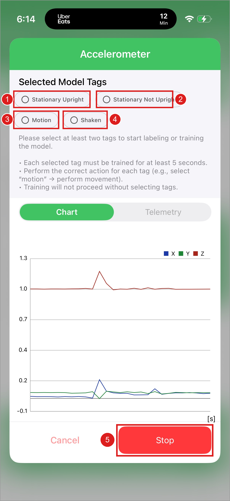
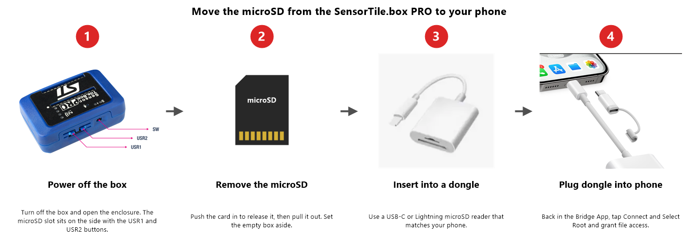
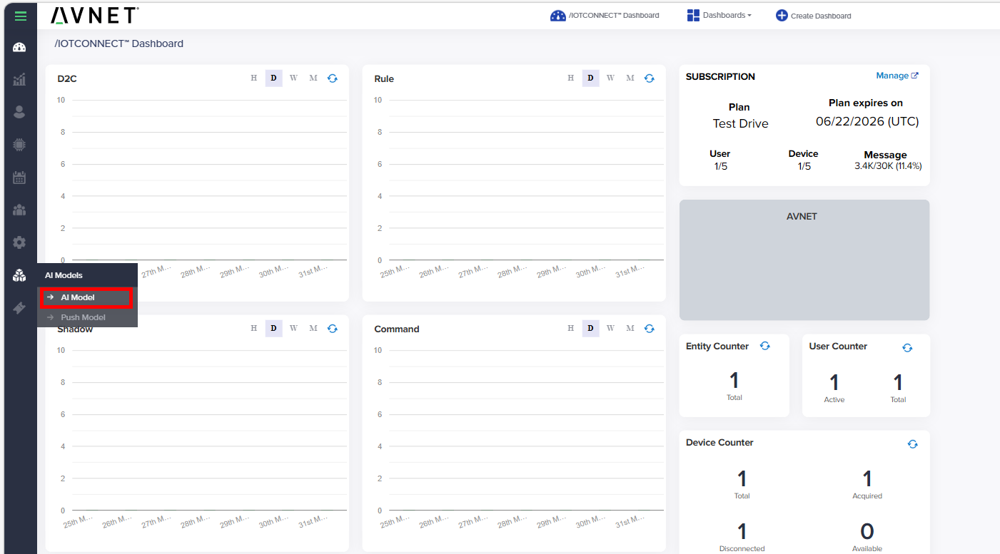
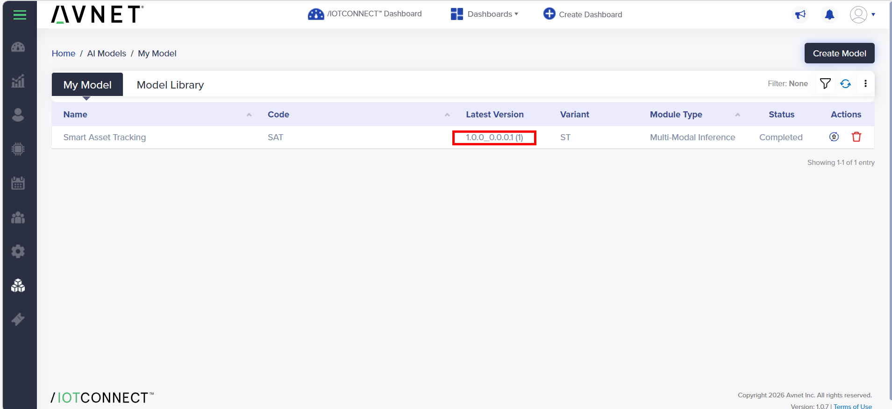

# Lab 2 — Train Your Own MLC Model with ST AIoT Craft <br> /IOTCONNECT Bridge App + ST SensorTile.box PRO

This is the second of two labs. In **[Lab 1](./st_aiotcraft_lab1_deploy.md)** you stood up an /IOTCONNECT account, paired the SensorTile.box PRO over BLE, pushed a starter MLC model, built a dashboard, and watched the full device → BLE → Bridge App → /IOTCONNECT → dashboard loop come alive. **Lab 2 picks up from there**: capture your own labeled sensor data, let ST AIoT Craft train a custom MLC model on it, and OTA the new model back to the same device — closing the **capture → train → deploy → inference → retrain** loop.


> **NOTE**
> This guide tracks the **AWS POC** instance of /IOTCONNECT (the environment used for the ST AIoT Craft preview). Production release is planned for mid-summer.

## Prerequisites

You should have completed **[Lab 1 — Deploy a Starter MLC Model](./st_aiotcraft_lab1_deploy.md)**. Specifically:

- /IOTCONNECT POC account with the **STAIOT** association created (Lab 1 Step 4)
- /IOTCONNECT Bridge App installed and logged in (Lab 1 Steps 5–6)
- SensorTile.box PRO paired and registered in /IOTCONNECT (Lab 1 Steps 7–9)
- A starter model pushed to the device and live inference confirmed end-to-end on the phone and on the dashboard (Lab 1 Steps 10–13)
- The dashboard you imported in Lab 1 Step 12 — you'll come back to it once your custom model is running

You will also need a **USB-C or Lightning microSD card reader** that plugs into your phone — uploading captured sessions to /IOTCONNECT requires popping the microSD out of the box and reading it from the phone (Step 2 below).

## 1. Capture Labeled Sensor Data for Training

This is the half of the loop that feeds **ST AIoT Craft**. Logging mode swaps the device out of inference and streams raw sensor samples into a session that gets zipped and uploaded to /IOTCONNECT.

**Switch the box into data-logging mode**

In the Bridge App, get to the **AI Model List** screen, make sure **Smart Asset Tracking** is selected, then tap **Data Logging** at the bottom (highlighted below). Two ways to get there depending on where you're starting from:

* **Coming straight from Lab 1.** The box is still in inference mode. Tap the back arrow on the inference view to return to the **AI Model List** — **Smart Asset Tracking** is still selected and the **Data Logging** button is active.
* **Starting Lab 2 fresh (re-opened the app, came back later).** The **AI Model List** may load with **Run Inference** and **Data Logging** greyed out — the app waits for an active model deployment before either button lights up. Re-push **Smart Asset Tracking** from /IOTCONNECT (see [Lab 1 Step 10](./st_aiotcraft_lab1_deploy.md#10-push-the-smart-asset-tracking-model)). Once the Bridge App receives the OTA over BLE (a few seconds), the buttons activate.


**Pick the sensor**

On the Select Sensor screen:

1. Tap **① Accelerometer**. The Start button activates as soon as a sensor is selected.
2. Tap **② Start**.


**Record one labeled segment per class — chained tags, ~20 seconds each**

The next screen shows all four classes as tags at the top — *Stationary Upright*, *Stationary Not Upright*, *Motion*, *Shaken* — over a live chart of the accelerometer stream. Logging is already active when you land here.

> **THE GOLDEN RULE — no gaps between labels**
> From the moment you press your first tag until you release your last one, **some tag must always be active**. To move between classes, **press the next tag first, then release the previous one** — the brief one-second overlap during the handoff is harmless, but even a moment of untagged time *between* labels makes AIoT Craft reject the whole session (**job failed / "No valid datalogs"**). Untagged time *before* the first tag and *after* the last release is fine.

Have the sequence in your head before you start — once the first tag is pressed there are no pauses. Work through all four tags **in sequence**, ~20 seconds per tag:



1. Stand the box upright on a flat surface, let it settle, then tap **① Stationary Upright**. Hold ~20 seconds.
2. Tap **② Stationary Not Upright**, release **①**, then lay the box on its side (or upside down). Hold ~20 seconds.
3. Tap **③ Motion**, release **②**, then move the box around — slide it, rotate it, carry it. Vary the movement. ~20 seconds.
4. Tap **④ Shaken**, release **③**, then shake the box — **start with a gentle rattle and build up to a hard shake** across ~20–25 seconds. The sweep teaches the model to recognize gentle shaking too, not just your most vigorous one.
5. Release **④ Shaken** while still shaking, then tap **⑤ Stop** to end the session (each tag shows a green checkmark and the chart fills with data, as below).


> **Labeling — the rules that matter**
> 1. **No gaps between labels.** Hand off tags press-before-release (the golden rule above). This is the #1 cause of *job failed / No valid datalogs*.
> 2. **At least 2 labels, ~20 seconds each, roughly equal time per class.** Unbalanced classes bias the model toward the over-represented ones.
> 3. **Don't leave multiple tags stacked.** The one-second handoff overlap is fine, but recording long stretches under several tags at once labels the same data as *every* class and produces a model that can't learn the rarer ones.
> 4. **Variety within a segment beats a longer segment.** Sweep the shake intensity, vary the motion style, use a different resting orientation each session. You can also re-press a label later in the chain to add a second segment of the same class.
> 5. **Verify before you upload.** Open the session folder and check `acquisition_info.json` — if it shows an empty `"tags": []`, you tagged nothing (or you're looking at the wrong folder), and the session cannot train.

> **NOTE — why the no-gap rule exists**
> The current AIoT Craft preview rejects any session with untagged data **between** labels, even though ST's Dataset API documents unlabeled chunks as a normal case. Treat the no-gap technique as a workaround for the preview environment — it may relax once the pipeline is updated.

> **TIP — capturing variety without breaking the chain**
> - **Motion and Shaken vary freely inside one tag.** Every second of handling or shaking genuinely is that class, so change style, direction, and intensity mid-segment — shake along different axes, slide then carry then rotate.
> - **For a second orientation of a stationary class, bridge through Motion.** While the current stationary tag is active, press **Motion** and release the stationary tag, reposition the box (that handling *is* real motion data), settle it in the new orientation, then press the stationary tag again and release **Motion**. The chain stays gapless, the transition is labeled correctly, and the class gains a second clean segment:
>   *upright → motion → not-upright (on its side) → motion → not-upright (upside down) → motion → shaken*
> - When adding segments this way, keep the **total** time per class roughly balanced.

Stopping the session leaves the labeled data on the SensorTile.box PRO's microSD card — it does **not** auto-upload. **Step 2** walks through pushing it to /IOTCONNECT so AIoT Craft can train on it.

## 2. Push Samples to /IOTCONNECT

To kick off training, the session files have to move from the device's microSD card up to /IOTCONNECT. The Bridge App's **SD Card** screen walks you through it.

1. **Stop training.** Confirm you're back at the *Accelerometer* screen with logging stopped and your tags still selected.

   

2. **Find the log folder.** Open the **SD Card** section in the Bridge App. You'll see a "Follow these steps" help screen explaining the dongle workflow.

   

3. **Move the microSD card from the box to your phone.** This part trips people up — the card has to physically come out of the SensorTile.box PRO, go into a microSD-to-USB dongle, and that dongle plugs into your phone. Your phone does **not** read the card wirelessly.

   

   1. **Power off the box** and open the enclosure. The microSD slot is on the side **opposite the gold capacitive touch pads** — the gold patterns visible on one side of the board are touch sensors, *not* the SD slot.
   2. **Push the microSD card to release it** and pull it out. Set the empty box aside.
   3. **Insert the microSD into a dongle** — a USB-C dongle for Android or newer iPhones, a Lightning dongle for older iPhones.
   4. **Plug the dongle into your phone.**

   Back in the Bridge App, tap **Connect and Select Root**, grant file access, and browse to the `STM32` folder — each logging session is a date-named folder (e.g. `20260429_21_30_06`).

   

4. **Select / push the files.** Open the session you just recorded — the folder name is its date and start time, and it is **not always the most recent folder** (an aborted or untagged run can sit above it). Confirm `acquisition_info.json` has your tags (rule 5 in Step 1), then tick all three files (`acquisition_info.json`, `device_config.json`, and `lsm6dsv16x_acc.dat` / `_gyro.dat`) and push.

   

5. **Upload Success.** When the bundle has been zipped and accepted by /IOTCONNECT, the app shows an **Upload Success** confirmation. The session is now queued for AIoT Craft to consume.

   

> **NOTE**
> The upload is the trigger for AIoT Craft to start training. If a session never makes it into /IOTCONNECT, no `.ucf` model will come back — make sure each labeled session ends with the **Upload Success** popup.

## 3. Inspect a Logged Session

Each session is a folder on the device's SD card (and a zip in /IOTCONNECT) containing three artifacts:

| | |
|---|---|
|  |  |

* **`acquisition_info.json`** — every label you pressed, with start/stop timestamps. The cloud uses this to slice the raw `.dat` files into labeled chunks.
* **`device_config.json`** — sensor configuration (ODR, full-scale, enabled axes) at recording time. The cloud needs this to interpret the binary correctly.
* **`lsm6dsv16x_acc.dat` / `lsm6dsv16x_gyro.dat`** — raw binary samples, parsed and chunked into CSV by AIoT Craft.

To find the upload in /IOTCONNECT, open your device's Device Info page and click the **Telemetry Files** tab. Each row is one logging session with timestamp, size, and a download link.

> **NOTE**
> If a freshly stopped session doesn't appear immediately, give it a minute — the upload happens after the session closes, not during recording.

## 4. Find Your Trained Model in /IOTCONNECT

When AIoT Craft finishes training (typically ~30 seconds after the upload is accepted), a new entry appears in your AI Model library — distinct from the read-only **Model Library** used in **Lab 1 Step 10**, this is the **My Model** list of models trained on your own data.

1. From the left menu, click the **AI Models** icon and then **AI Model** (highlighted below).

   

2. Your trained model shows up in the **My Model** tab as soon as training completes — typically within ~30 seconds. Status reads **Completed** when it's ready to push. Click the **Latest Version** (highlighted below) to open the training-run details.

   

3. The **Version List** dialog opens, listing every training run AIoT Craft has produced for this model — useful when you've captured multiple datasets and want to compare or roll back. Each row shows the file name, version, creation date, and a **Completed** status when ready.

   

> **NOTE**
> If the model doesn't appear within a couple of minutes, check that the STAIOT association from **Lab 1 Step 4** is still active and that the upload completed (Step 2 above ended in **Upload Success**). A *job failed* or *No valid datalogs* status here almost always means the session broke a labeling rule from **Step 1** — most often an untagged gap between labels, or a single-label session.

**Reassemble the box and re-pair**

The microSD is still in your phone from **Step 2** and the box is powered off — put the box back together and reconnect before you OTA the new model:

1. **Eject** the microSD dongle from your phone (use your OS's safe-eject flow), then move the microSD back into the SensorTile.box PRO (same slot, opposite the gold capacitive touch pads) and close the enclosure.
2. **Power the box on.**
3. **Re-pair** in the Bridge App — open the app and tap your box in the **Searched bluetooth device list** (same 7-character identifier as in [Lab 1 Step 7](./st_aiotcraft_lab1_deploy.md#7-pair-the-sensortilebox-pro)). The app lands on the **AI Model List** with **Connected** at the top.

**Deploy your trained model**

With the box re-paired, push your custom model over the same **Push Model** form you used in **Lab 1 Step 10** — with one important change in the **Version** field:

1. /IOTCONNECT → **AI Models → Push Model**. Fill in the form:
   - **Model** — pick **Smart Asset Tracking** (same name as the starter; the **Version** is what distinguishes your custom one).
   - **Version** — **open the dropdown and select your trained version** (it appears with a parenthesized count, e.g. `1.0.0_0.0.0.26 (2)`, distinct from the starter `1.0.0` at the top of the list). The dropdown defaults to the starter — **this is the step that's easy to miss.**
   - **Device Template** — `AvnetSTaws`.
   - **Select Device** — switch to **Selected devices** and pick your device.
2. Click **Push Model**. The Bridge App receives the OTA over BLE within a few seconds.

**Run inference on your custom model**

1. In the Bridge App, return to the **AI Model List** — **Smart Asset Tracking** is still selected, now reflecting your new version.
2. Tap **Run Inference** at the bottom. The app pushes the device into inference mode, downloads the new model bundle, and the live classification screen opens.
3. Pose the box (set it flat, tip on its side, move it, shake it — same gestures from **[Lab 1 Step 13](./st_aiotcraft_lab1_deploy.md#13-exercise-the-live-inference)**) and watch the four classes light up. These are now coming from the model **you** trained, not the starter.
4. Open the dashboard you built in **Lab 1 Step 12** — the **Smart Asset Monitoring** widget and the **Inference History** pie reflect your custom model's classifications end-to-end, alongside the raw telemetry you saw at the end of Lab 1.

## 5. Recap — The MLC Retraining Loop

You've closed the **capture → upload → train → deploy → inference → retrain** loop. Here's what you did across both labs on one page, followed by what was happening under the hood.

| Stage | Time | What you did | Where |
|---|---|---|---|
| **1. Connect** | ~10 min | Account · STAIOT association · BLE pair · template/device verified | Lab 1, Steps 1–9 |
| **2. Deploy a model** | ~10 min | OTA push a starter model · live inference on device | Lab 1, Steps 10–11 |
| **3. Visualize & verify** | ~10 min | Import dashboard · confirm classifications + raw telemetry end-to-end | Lab 1, Steps 12–13 |
| **4. Capture data** | ~15 min | Switch into logging mode · record labeled sessions · push samples via dongle | Lab 2, Steps 1–3 |
| **5. Train & redeploy** | ~15 min | AIoT Craft trains a model · find it under My Model · OTA back · see your model run | Lab 2, Step 4 |

**Under the hood**

Once one or more labeled sessions are sitting in /IOTCONNECT, the connector you set up in **Lab 1 Step 4** forwards the binary HSD data to ST AIoT Craft, which runs AutoML / AFS to produce a `.ucf` MLC model. AIoT Craft pushes that model **back** into your account's AI Model Library, where a single **Push Model** click delivers it to the device:

```
[Device]            [BLE]      [Bridge App]   [/IOTCONNECT]   [Connector]   [ST AIoT Craft]
   │                  │             │              │              │              │
   │ MLC inference ──►│ ───────────►│ Telemetry    │              │              │
   │                  │             │ ───────────► │ Stored as    │              │
   │                  │             │              │ template     │              │
   │ Switch→logging ◄─┤ ◄───────────┤ Cmd from     │              │              │
   │ datalog2 firmware│             │ cloud        │              │              │
   │                  │             │              │              │              │
   │ Raw .dat + JSON ►│ ───────────►│ Zip + upload │              │              │
   │                  │             │ ───────────► │ Forward via  │              │
   │                  │             │              │ connector ──►│ Blob ingest  │
   │                  │             │              │              │ (binary-hsd) │
   │                  │             │              │              │ ───────────► │ Chunks (CSV)
   │                  │             │              │              │              │ AutoML / AFS
   │                  │             │              │              │              │ trains MLC
   │                  │             │              │              │ ◄────────────┤ .ucf model
   │                  │             │              │ Model ◄──────┤              │
   │                  │             │              │ registered   │              │
   │                  │             │              │ in library   │              │
   │ load_model PnPL ◄┤ ◄───────────┤ Push model   │              │              │
   │ command          │             │ (OTA)        │              │              │
   │                  │             │              │              │              │
   │ MLC reprogrammed,│             │              │              │              │
   │ inference resume►│ ───────────►│ ───────────► │ Live again   │              │
```

> **Capture → Upload → Train → Deploy → Inference → (capture more) → Retrain**

## Optional — Build Your Own Custom Experiences

/IOTCONNECT exposes everything used in this guide via REST and AWS-native connectors:

* REST API docs: <https://docs.iotconnect.io/iotconnect/rest-api/>
* Swagger (POC): <https://awspocmaster.iotconnect.io/api/v2.1/swagger-json>
* AWS connectors: S3, DynamoDB, SNS, SageMaker, Kinesis, Lambda, Greengrass, EventBridge, Grafana

Webhooks for inbound events, OAuth 2.0 across the API, and CI/CD-friendly OTA triggers mean every step in this guide can be scripted.

## See Also

* [Lab 1 — Deploy a Starter MLC Model](./st_aiotcraft_lab1_deploy.md) — the connect + deploy + dashboard half of this loop
* [Engineering Note — Hardware Revisions, DATALOG2 Firmware & BlueST SDK Compatibility](./st_aiotcraft_engineering_note.md) — why the labs standardize on v3.1.0, failure signatures, and AWS/Azure environment notes
* [Main Mobile App Guide](./mobile_app_guide.md) — the production AWS flow with `BLESensorsPnPL.bin` / `STSW-MKBOXPRO_1_1_1.bin` firmwares
* [SensorTile.box PRO Getting Started Guide](https://www.st.com/resource/en/user_manual/um3133-getting-started-with-sensortilebox-pro-multisensors-and-wireless-connectivity-development-kit-for-any-intelligent-iot-node-stmicroelectronics.pdf) — DFU mode, hardware reference
* [/IOTCONNECT Product Updates](https://docs.iotconnect.io/iotconnect/platform/product-updates/) — AIoT Craft GA timeline
