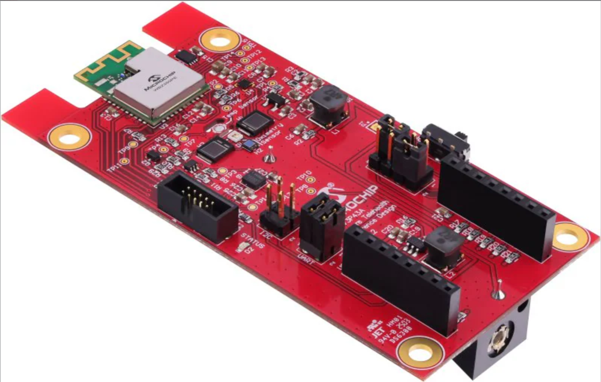
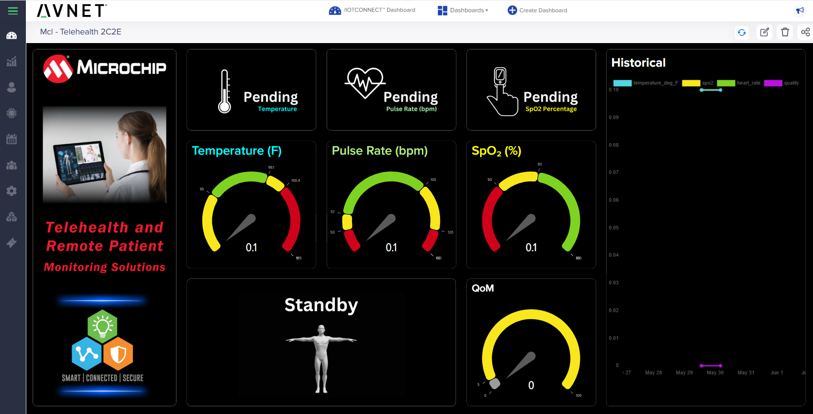
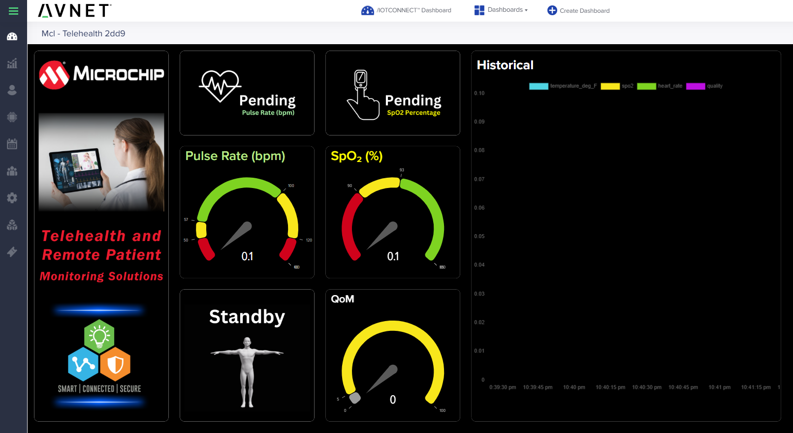
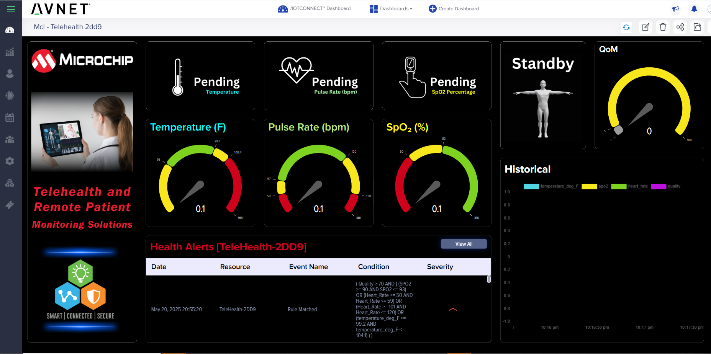
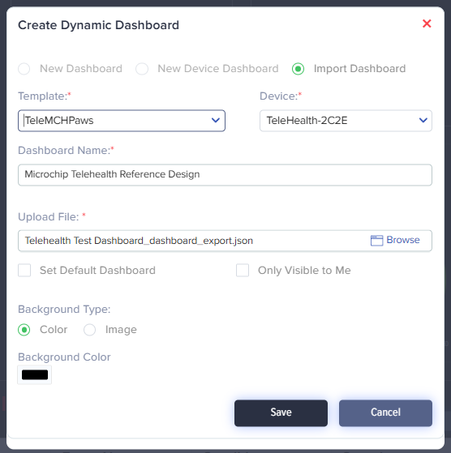

# /IOTCONNECT Mobile App with Microchip Secure Telehealth Reference Design  

This guide explains how to configure the Avnet /IOTCONNECT Mobile App as a Bluetooth gateway for the Microchip Secure Telehealth Reference Design. The app captures telemetry data via Bluetooth and securely uploads it to IoTConnect for cloud visualization.

  

### Telemetry Supported:
- **Quality of Measurement**
- **Temperature**
- **Heart Rate**
- **SPO₂ (Blood Oxygen Level)**

---

## Prerequisites  

Ensure you have:

- An [/IOTCONNECT](https://iotconnect.io) account (see [Cloud Account Setup](#7-cloud-account-setup))
- Android or iOS smartphone (*Bluetooth Gateway*)
- [Microchip Secure Telehealth Reference Design](https://www.microchip.com/en-us/tools-resources/reference-designs/secure-telehealth-reference-design)  
- Request the Firmware HEX file from the [Microchip website](https://www.microchip.com/en-us/tools-resources/reference-designs/secure-telehealth-reference-design)
- [MPLAB® X IDE](https://www.microchip.com/en-us/tools-resources/develop/mplab-x-ide) or [MPLAB IPE](https://www.microchip.com/en-us/tools-resources/production/mplab-integrated-programming-environment)  
- [PICkit™ 5 Programmer](https://www.microchip.com/en-us/development-tool/pg164150)  
  
- [AC102015 Adapter Board](https://www.microchip.com/en-us/development-tool/AC102015)   
  
- USB-C cable  
- PC (Windows, macOS, Linux)

---

## Step-by-Step Guide

### 1. Download /IOTCONNECT Mobile App  

Use QR codes below:

| iOS App                                                                            | Android App                                                                                 |
|------------------------------------------------------------------------------------|---------------------------------------------------------------------------------------------|
|  |  |

Launch the app once installed.

---

### 2. Cloud Account Setup

An /IOTCONNECT account with AWS backend is required. If you need to create an account, a free trial subscription is available.  
The free subscription may be obtained directly from iotconnect.io or through the AWS Marketplace.

- **Option #1:** [/IOTCONNECT via AWS Marketplace](https://github.com/avnet-iotconnect/avnet-iotconnect.github.io/blob/main/documentation/iotconnect/subscription/iotconnect_aws_marketplace.md) **(Recommended)** - 60-day trial; AWS account creation required
- **Option #2:** [/IOTCONNECT via iotconnect.io](https://subscription.iotconnect.io/subscribe?cloud=aws) - 30-day trial; no credit card required

> **NOTE:**  
> Be sure to check your SPAM folder for the temporary password after registering.

See the [/IOTCONNECT Subscription Information](https://github.com/avnet-iotconnect/avnet-iotconnect.github.io/blob/main/documentation/iotconnect/subscription/subscription.md) for more details.

---

### 3. Log into /IOTCONNECT Mobile App  

- Enter your credentials  
- Select environment: `console.iotconnect.io (AWS)`  
- Tap **Login**

  

---

### 4. Program Firmware onto Telehealth Device  

Choose **one** programming method:

#### Option A: MPLAB® X IDE  

- Connect PICkit 5 and Adapter to your Telehealth device and PC.
- Open MPLAB® X IDE, select your device and PICkit 5, load project, then **Make and Program Device**.

#### Option B: MPLAB IPE *(HEX file only)*

- Connect PICkit 5 and Adapter to your Telehealth device and PC.
- Open MPLAB IPE, select your device, PICkit 5, load HEX file, and press **Program**.

  

---

### 5. Connect Device & Publish Data  

- Power the device.
- Open /IOTCONNECT Mobile App:
  - Tap the green menu button, select **Scan Device** if needed.
  
    

- Select your device from the list (e.g., "Microchip Telehealth").

The app automatically:

- Creates /IOTCONNECT template and registers your device.
- Lists available sensors (Quality, Temperature, Heart Rate, SPO₂).
- Choose **Select All** → **Push Data**.

---

### 6. View Live Data in /IOTCONNECT Cloud  

- Log into [/IOTCONNECT Console](https://console.iotconnect.io).
- Navigate to **Devices → Device**.
- Click your device’s **Unique ID**, then **Live Data**.

    

---

### 7. Visualize Data with Dashboards  

- Download the one of the example dashboards to view live telemetry (**must** Right-Click, "Save link as ...").
  
     [**Example Telehealth User Dashboard without Alerts**](https://raw.githubusercontent.com/avnet-iotconnect/iotc-gateway-mobile-app/refs/heads/mcp-telehealth-docs/targets/microchip/secure-telehealth-reference-design/dashboards/mchp-telehealth_no-alerts_dashboard.json)
  
  

    [**Example Telehealth User Dashboard without Temperature**](https://github.com/avnet-iotconnect/iotc-gateway-mobile-app/blob/mcp-telehealth-docs/targets/microchip/secure-telehealth-reference-design/dashboards/mchp-telehealth_no-temp_dashboard.json)
  
  
    
    [**Example Telehealth User Dashboard with Alerts**](https://raw.githubusercontent.com/avnet-iotconnect/iotc-gateway-mobile-app/refs/heads/mcp-telehealth-docs/targets/microchip/secure-telehealth-reference-design/dashboards/mchp-telehealth_dashboard.json)
  
  
     
- In /IOTCONNECT, select **Create Dashboard → Import Dashboard**.
- Complete the Import Dashboard form
    - Upload `.json` file
    - Select the device template, "TeleMCHPaws"
    - Select your active device
    - Provide a background color, suggest "black"
    - Finally, **Save**  
    

Your telemetry data is now visualized on a configurable dashboard.    
---

### Optional Next Steps  

- Configure /IOTCONNECT alerts for critical thresholds.
- Expand system capabilities via additional sensors or modules.

---

## Additional Resources  

- [Microchip Telehealth Reference Design Page](https://www.microchip.com/en-us/tools-resources/reference-designs/secure-telehealth-reference-design)
- [PICkit 5 Programmer](https://www.microchip.com/en-us/development-tool/pg164150)
- [AC102015 Adapter Board](https://www.microchip.com/en-us/development-tool/AC102015)

Your Microchip Secure Telehealth Reference Design is now successfully integrated with /IOTCONNECT!
